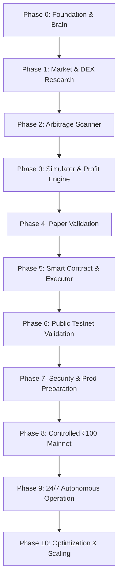

# MASTER_PLAN.md — Comprehensive Phase-by-Phase Roadmap

> **ROADMAP POLICY**: This master roadmap establishes the end-to-end progression of SAHIKARA from inception to autonomous real-money operation.  
> **RULE OF SEQUENTIAL PROGRESSION**: Skipping phases without explicit documentation and operator sign-off in `DECISIONS.md` is strictly forbidden.

---

## 1. Roadmap Architecture

The path to live capital execution is structured into 11 distinct phases (Phase 0 through Phase 10), followed by continuous scaling. Each phase acts as a security and feasibility airlock: work may not transition to Phase $N+1$ until the Exit Criteria of Phase $N$ are completely satisfied and verified.

---

## 2. Phase Breakdown & Gating Specifications

### PHASE 0 — Foundation & Project Brain
- **Objective**: Establish the canonical project memory, repository architecture, operational rules, security baselines, and risk boundaries.
- **Entry Criteria**: Project initiation request from operator.
- **Key Deliverables**: All 17 root Project Brain files, standardized directory structure, `.gitignore`, initial ADRs, established wallet lifecycle policy (Development Wallet permitted in Phase 0/early Phase 1 for testnet/dev only; Production Wallet strictly deferred to Phase 7/8).
- **Exit Criteria**: All 17 files fully populated, verified against non-negotiable rules, zero secrets, zero live trading code, approved by operator.
- **Risks & Failure Modes**: Incomplete documentation, ambiguous requirements, unrecorded assumptions.
- **Dependencies**: None.

---

### PHASE 1 — Market / DEX Research
- **Objective**: Conduct rigorous empirical research on target EVM chains (initially Polygon POS), analyzing DEX protocols (Uniswap v3, QuickSwap, SushiSwap), liquidity pool topologies, fee tiers (1 bp, 5 bps, 30 bps, 100 bps), volume distribution, gas dynamics, and block times.
- **Entry Criteria**: Phase 0 complete and verified.
- **Key Deliverables**: Comprehensive research report in `docs/strategy/`, pool registry, fee matrix, historical spread evaluation, token pair whitelist (e.g., WMATIC/USDC, WETH/USDC). Optional: Development Wallet creation for local/testnet experimentation (strictly zero meaningful funds; keys never committed or pasted into AI tools).
- **Exit Criteria**: Documented proof of recurring, non-trivial price dislocations between target DEX pools prior to transaction friction; clear selection of target token pairs and DEX contracts.
- **Risks & Failure Modes**: Highly efficient markets leaving zero gross spread, high RPC latency obscuring true state, toxic tokens with transfer taxes.
- **Dependencies**: Phase 0.

---

### PHASE 2 — Arbitrage Scanner
- **Objective**: Build a real-time, low-latency market state monitor that ingests block headers, mempool events (or new block states), and pool reserve logs to detect potential cross-DEX price discrepancies.
- **Entry Criteria**: Phase 1 research completed; whitelisted pairs and pool addresses finalized.
- **Key Deliverables**: `scanner/` engine, WebSocket/RPC listener, state cache, price discrepancy calculation pipeline, unit tests.
- **Exit Criteria**: Scanner reliably processes incoming blocks/events within sub-second latency, logs discrepancies without memory leaks, and demonstrates 99.9% uptime over a 48-hour continuous test.
- **Risks & Failure Modes**: RPC rate limits, dropped WebSocket connections, chain reorg desynchronization, stale state cache.
- **Dependencies**: Phase 1.

---

### PHASE 3 — Simulator & Profitability Engine
- **Objective**: Construct a high-fidelity off-chain transaction simulation engine that calculates exact net profitability after deducting all economic frictions: DEX swap fees, price impact (slippage curves), token decimals, and dynamic gas costs.
- **Entry Criteria**: Scanner operating reliably in Phase 2.
- **Key Deliverables**: `simulator/` engine, exact swap math model (constant product $x \cdot y = k$ and concentrated liquidity tick math), dynamic gas price model, net profit formula implementation, benchmark suite.
- **Exit Criteria**: Exact match between simulator predictions and on-chain `eth_call` / tenderly trace results across $\ge 100$ simulated test cases. Proof of positive net expected profit on historical or real-time opportunities.
- **Risks & Failure Modes**: Inaccurate tick math approximations, underestimating gas overhead, miscalculating token transfer fees.
- **Dependencies**: Phase 2.

---

### PHASE 4 — Paper Validation & Shadow Execution Research (Phases 4.0 – 4.18)
- **Objective**: Deploy the Scanner and Simulator in a non-executing, live paper-trading environment to validate theoretical profitability against live blockchain dynamics without risking real capital.
- **Progress Summary**:
  - Phase 4.0–4.12: Multi-chain discovery, canonical bytecode verification, graph-based routing, MEV reality, and sensitivity matrices.
  - Phase 4.13A–4.15: High-resolution monotonic timing, CEX-DEX microstructure (Coinbase, Binance, Kraken), volatility regimes, and transport latency floors.
  - Phase 4.16–4.17: Local in-memory DEX state reconstruction, multi-tick concentrated liquidity traversal, and cross-DEX validation (Uniswap V3 & Aerodrome V2).
  - Phase 4.18: Continuous read-only shadow detection pipeline integrating CEX feeds, local DEX state, microsecond candidate screening, economic gating, QuoterV2 verification, and shadow outcome persistence.
- **Entry Criteria**: Phase 3 simulator validated against `eth_call`.
- **Key Deliverables**: Automated paper-trading logger, metrics dashboard, win/loss tracking, spread decay analysis, persistence layer, `ContinuousShadowPipeline`.
- **Exit Criteria**: Continuous read-only shadow detection operating with exact on-chain mathematical parity, microsecond screening latency, and 100% spurious call reduction.
- **Status**: **PHASE 4.18 COMPLETE — PHASE 5 ELIGIBILITY REVIEW REQUIRED**.
- **Risks & Failure Modes**: Fast spread decay (opportunities disappearing before block inclusion due to MEV bots), phantom liquidity.
- **Dependencies**: Phase 3.

---

### PHASE 5 — Smart Contract / Executor
- **Objective**: Develop clean, minimal, secure atomic arbitrage execution smart contracts in Solidity, accompanied by an off-chain transaction builder and signer. The contract must bundle multi-hop swaps atomically and revert if net profit is below minimum threshold.
- **Entry Criteria**: Successful Phase 4 paper validation showing persistent opportunities.
- **Key Deliverables**: `contracts/ArbitrageExecutor.sol`, hardhat/foundry test suite, `executor/` transaction generator, slippage guardrails, emergency withdrawal functions, reentrancy guards.
- **Exit Criteria**: 100% test coverage on contracts, fuzz testing via Foundry/Echidna, zero vulnerabilities in static analysis (Slither).
- **Risks & Failure Modes**: Smart contract bugs, reentrancy, unhandled revert codes, front-running by public mempool searchers.
- **Dependencies**: Phase 4.

---

### PHASE 6 — Public Testnet Validation
- **Objective**: Deploy `ArbitrageExecutor.sol` and the automated pipeline to a public testnet (e.g., Polygon Amoy / Sepolia) to validate real network RPC interactions, gas estimation, nonces, and failure recovery under live latency.
- **Entry Criteria**: Phase 5 smart contracts fully audited and fuzz-tested.
- **Key Deliverables**: Testnet deployment scripts, live automated testnet runner, log traces of simulated arbitrage executions.
- **Exit Criteria**: Minimum 50 successful testnet executions without stuck nonces, unhandled RPC errors, or unintended reverts.
- **Risks & Failure Modes**: Testnet liquidity imbalances, testnet RPC instability, faucet limitations.
- **Dependencies**: Phase 5.

---

### PHASE 7 — Security & Production Preparation
- **Objective**: Complete exhaustive security review, establish production infrastructure isolation, generate dedicated production wallet, configure alerting/monitoring systems, and perform emergency kill switch dry runs.
- **Entry Criteria**: Flawless Phase 6 testnet run.
- **Key Deliverables**: Security audit sign-off in `docs/security/`, dedicated air-gapped production execution wallet generation (strictly deferred until this stage; completely isolated from personal wallet), encrypted key store, automated alerting (Telegram/Discord/PagerDuty), documented incident runbook.
- **Exit Criteria**: Operator and multi-agent audit sign-off, successful drill of emergency kill switch, zero high/medium security vulnerabilities.
- **Risks & Failure Modes**: Operational complacency, key leakage during generation, misconfigured alerting.
- **Dependencies**: Phase 6.

---

### PHASE 8 — Controlled ₹100 Mainnet Experiment
- **Objective**: Execute the first real-money live mainnet experiment with capital strictly capped at ₹100 (in equivalent native/stable token, e.g. POL/USDC), operating under 100% operator supervision.
- **Entry Criteria**: Formal operator approval of Phase 7 audit, dedicated production wallet funded with exactly ₹100.
- **Key Deliverables**: Live execution logs, gas expenditure logs, realized PnL analysis in `docs/finance/`, post-experiment post-mortem.
- **Exit Criteria**: Execution of at least 3 live transactions without contract failure, loss capped within risk boundaries, verification of actual vs. expected net profit.
- **Risks & Failure Modes**: Front-running (sandwich attacks), gas price spikes causing negative yield, revert costs consuming capital.
- **Dependencies**: Phase 7.

---

### PHASE 9 — 24/7 Resilient Autonomous Operation
- **Objective**: Transition system to robust, continuous 24/7 operation with automated self-healing, multi-provider RPC failover, real-time telemetry, and automated circuit breakers.
- **Entry Criteria**: Phase 8 success with verified profitability or positive expectancy.
- **Key Deliverables**: Production deployment configs (Docker/systemd), Prometheus/Grafana metrics, automated alerting, multi-region RPC routing.
- **Exit Criteria**: 14 consecutive days of autonomous execution without manual intervention, zero unhandled errors, strict adherence to daily risk limits.
- **Risks & Failure Modes**: Server crashes, ISP/network partitions, silent RPC desync, memory leaks.
- **Dependencies**: Phase 8.

---

### PHASE 10 — Optimization & Scaling
- **Objective**: Expand system capabilities to maximize capital efficiency, integrate flash swaps (zero-capital borrowing), expand to additional DEXs and EVM chains, and deploy private RPC bundles (Flashbots/MEV-Share) to eliminate front-running risk.
- **Entry Criteria**: Phase 9 operational stability verified.
- **Key Deliverables**: Flash loan integrations (Balancer/Aave/Uniswap), private mempool bundle submission pipeline, multi-chain adapter modules.
- **Exit Criteria**: Documented scaling metrics, reduced revert rate to $<1\%$, positive risk-adjusted alpha.
- **Risks & Failure Modes**: Increased smart contract complexity, cross-chain bridge risks, fee structure changes.
- **Dependencies**: Phase 9.

---

## 3. Future Expansion Vectors (Post-Phase 10)

1. **Flash Arbitrage**: Zero-capital initial balance, borrowing and repaying within a single atomic transaction.
2. **Multi-DEX Aggregation**: Dynamic routing across 5+ DEX protocols (Curve, Balancer, DODO, etc.).
3. **Multi-Chain Topology**: Deploying specialized worker nodes across Arbitrum, Optimism, Base, BSC, and Avalanche.
4. **Statistical / Predictive Arbitrage**: Machine-learning assisted order flow forecasting (advisory only; execution remains deterministic).
