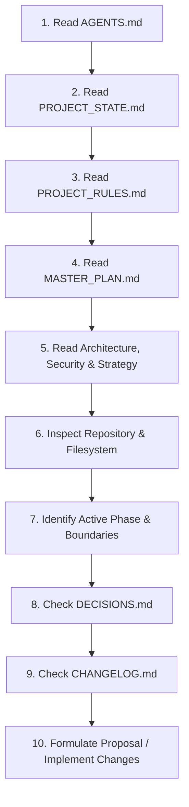

# ONBOARDING_AN_AGENT.md — Step-by-Step Agent Onboarding Protocol

> **MANDATORY INITIATION SEQUENCE**: Any artificial intelligence agent, automated assistant, or new human contributor joining the SAHIKARA project must complete this 10-step onboarding sequence before proposing, modifying, or executing any changes.

---

## 1. The 10-Step Onboarding Sequence

### Step 1: Read `AGENTS.md`
- **Objective**: Understand operational mandates, verification expectations, and strict prohibitions.
- **Key Check**: Confirm you understand that deterministic code controls capital and AI assists.

### Step 2: Read `PROJECT_STATE.md`
- **Objective**: Internalize the current reality of the project.
- **Key Check**: Check active phase, capital deployed (must be ₹0 currently), live trading flag (`DISABLED`), and active blockers.

### Step 3: Read `PROJECT_RULES.md`
- **Objective**: Memorize the 18 non-negotiable principles.
- **Key Check**: Confirm that security overrides speed, personal wallets remain isolated, and zero secrets may be committed.

### Step 4: Read `MASTER_PLAN.md`
- **Objective**: Understand where the current task sits in the 11-phase master roadmap.
- **Key Check**: Verify entry and exit criteria for the active phase; never skip phases.

### Step 5: Read Domain-Specific Core Documents
- Read [`ARCHITECTURE.md`](./ARCHITECTURE.md): Review component boundaries (Scanner, Simulator, Contracts, Executor).
- Read [`STRATEGY.md`](./STRATEGY.md): Understand the spatial cross-DEX model, friction components, and net profit formula.
- Read [`SECURITY.md`](./SECURITY.md): Review threat models, wallet isolation, and incident protocols.
- Read [`RISK_POLICY.md`](./RISK_POLICY.md): Internalize provisional trading and operational boundaries.

### Step 6: Inspect the Repository & Filesystem
- Perform a thorough inspection of the workspace (`list_dir`, checking files in `contracts/`, `scanner/`, `simulator/`, `tests/`, etc.).
- Ensure you know what files already exist before proposing additions or refactoring.

### Step 7: Identify Current Phase & Operational Scope
- Identify precisely what is allowed in the current phase.
- In Phase 0: Only documentation and project scaffolding are allowed. No live trading code!

### Step 8: Check `DECISIONS.md`
- Review the Architecture Decision Records (ADRs) to understand approved (`DEC-001` through `DEC-007`) and provisional (`DEC-008`, `DEC-009`) baselines.
- Do not propose changes that contradict ratified decisions without a formal ADR proposal.

### Step 9: Check `CHANGELOG.md`
- Review recent commits and modifications to ensure you are not duplicating recent work or undoing intentional changes.

### Step 10: Only Then Propose or Implement Changes
- Formulate your plan or code modifications.
- Execute within the bounded constraints of the active phase.
- Verify tests and update `PROJECT_STATE.md`, `CHANGELOG.md`, and other Brain documents upon completion.

---

## 2. Fast Verification Questionnaire for Incoming Agents

Before generating any output, ask yourself:
1. *What phase is the project in right now?* (Answer must match `PROJECT_STATE.md`).
2. *Is live trading enabled?* (Answer must be NO).
3. *Am I handling any private keys or credentials?* (Answer must be NO).
4. *Are my risk parameters marked PROVISIONAL or backed by empirical data?*
5. *Does my proposed code introduce dependencies that violate Rule 12?*
