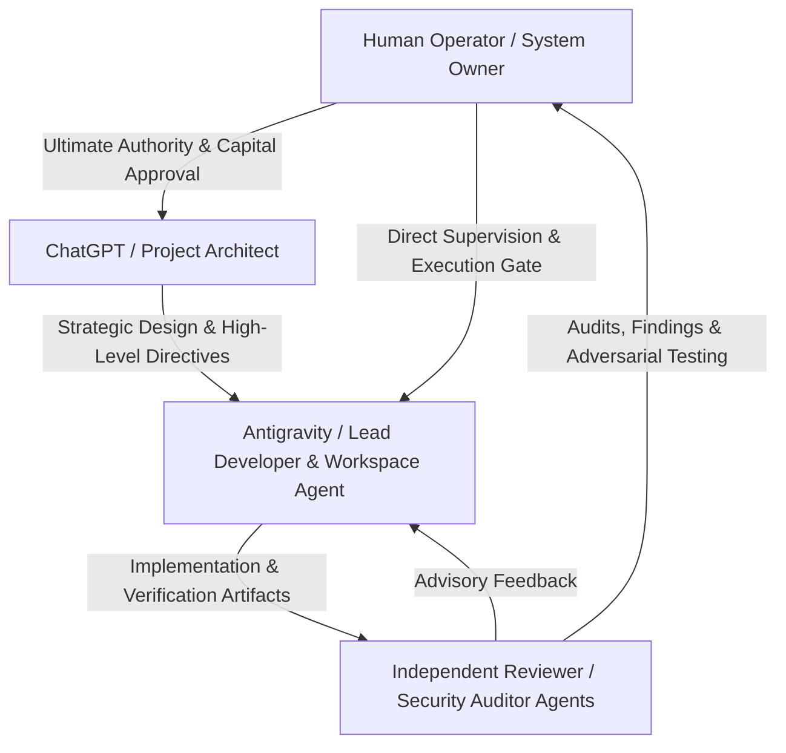
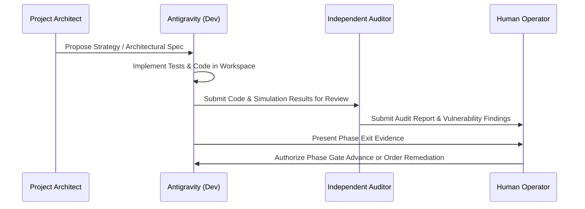

# PROJECT_OPERATING_MODEL.md — Collaborative Multi-Agent & Human Operating Model

> **PURPOSE**: This document establishes the governing division of responsibility, communication protocols, approval gates, and escalation pathways among the participants building and operating SAHIKARA.

---

## 1. Operating Roles & Responsibilities

The SAHIKARA engineering and operational lifecycle involves four distinct entities:

### 1.1 The Human Operator (System Owner & Capital Controller)
- **Authority**: Absolute, unchallengeable sovereign authority over capital, live trading switches, wallet credentials, and phase transitions.
- **Key Responsibilities**:
  - Sole authorized signer and guardian of private keys.
  - Final decision-maker on approving phase transitions and capital deployments.
  - Reviews and signs off on Architecture Decision Records (ADRs) in `DECISIONS.md`.
  - Holds the emergency manual kill switch.

### 1.2 ChatGPT / Project Architect (Strategic & Quantitative Lead)
- **Role**: High-level system architecture, quantitative strategy formulation, risk modeling, mathematical verification, and adversarial thought partnership.
- **Key Responsibilities**:
  - Reviews holistic roadmap progression and macro strategy.
  - Proposes and scrutinizes algorithmic formulas, fee models, and pool mechanics.
  - Identifies theoretical edge cases, game-theoretic MEV competition dynamics, and systemic risks.
  - Authors strategic proposals for consideration by the Human Operator.

### 1.3 Antigravity (Lead Developer & Workspace Implementation Agent)
- **Role**: Primary technical builder, code author, tool orchestrator, test automator, and repository custodian.
- **Key Responsibilities**:
  - Implements clean, secure, well-tested code in accordance with approved architectural blueprints.
  - Executes repository maintenance, linting, formatting, and unit/integration testing.
  - Enforces `PROJECT_RULES.md` and maintains the Project Brain (`PROJECT_STATE.md`, `CHANGELOG.md`, `DECISIONS.md`).
  - Prepares comprehensive test evidence before proposing phase advancement.

### 1.4 Independent Specialist / Reviewer Agents (Adversarial Auditors)
- **Role**: External or specialized agent instances brought in specifically to review, audit, fuzz, red-team, and challenge the codebase and assumptions.
- **Key Responsibilities**:
  - Performs independent static analysis and security auditing (e.g., reentrancy, access control, integer overflow).
  - Challenges profitability claims and hunts for unhandled edge cases or slippage calculation errors.
  - Delivers unvarnished vulnerability reports directly to the Human Operator.

---

## 2. Decision & Approval Workflow

### Rules of Engagement:
1. **No Unilateral Phase Transitions**: Neither Antigravity nor the Architect may declare a phase transition complete without explicit Human Operator sign-off.
2. **Adversarial Scrutiny**: High-impact components (especially `contracts/` and `executor/`) must be reviewed with an adversarial mindset before touching testnets or mainnet.
3. **Traceability**: All interactions leading to architectural or risk changes must be distilled into `DECISIONS.md` and committed to Git.
4. **Conflict Resolution**: If Antigravity and the Project Architect disagree on an implementation detail or risk assessment, the issue is escalated to the Human Operator with a summary of trade-offs. The Human Operator's ruling is final.

---

## 3. Session Handoff & Continuity Protocol

To guarantee seamless continuity across sessions or model transitions:
- Every active session must conclude with an updated `PROJECT_STATE.md` and `CHANGELOG.md`.
- No critical context may remain trapped in ephemeral conversational memory.
- Incoming agents must execute the sequence defined in `ONBOARDING_AN_AGENT.md` before performing any edits.
