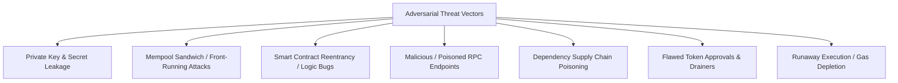

# SECURITY.md — Comprehensive Security Policy & Threat Model

> **SECURITY AXIOM**: Security is the highest priority of SAHIKARA. A system that generates high returns but loses capital to an exploit, a key leak, or an unhandled revert is a failed system. Capital preservation is paramount.

---

## 1. Threat Model & Attack Surface

The SAHIKARA system operates in an adversarial environment characterized by smart contract exploits, mempool front-running bots, malicious RPC endpoints, and supply-chain vulnerabilities.

---

## 2. Core Security Domains

### 2.1 Wallet Isolation & Key Management Architecture
The system enforces a strict 3-tier wallet lifecycle:

- **Tier 1: Personal Wallet (Permanent Air-Gap)**:
  - Personal or cold-storage addresses must never be linked, imported, or touched by SAHIKARA code, tests, or scripts.
  - Zero shared lineage with any development or operational tooling.

- **Tier 2: Development Wallet (Phase 0 / Early Phase 1 Lifecycle)**:
  - **Creation Window**: May be created during Phase 0 or early Phase 1.
  - **Scope**: Used strictly and exclusively for local development, setup scripts, and testnet experimentation (e.g., testnet faucets on Polygon Amoy / Sepolia).
  - **Capital Boundary**: Must **never contain meaningful real-world funds**.
  - **Key Hygiene**: Private keys and seed phrases must **never be committed to Git, pasted into AI tools or chat prompts, or stored in source code**. They must reside only in untracked local environment configs (`.env`) or local keystores that are strictly filtered by `.gitignore`.

- **Tier 3: Production Execution Wallet (Strictly Deferred to Phase 7/8)**:
  - **Creation Window**: Must remain strictly deferred until the production/mainnet preparation stage (Phase 7/8).
  - **Isolation**: Must be a newly generated, dedicated SAHIKARA wallet completely isolated from the operator's personal wallet.
  - **Generation**: Generated on an air-gapped machine using standard CSPRNG tools.
  - **Capital Boundary**: Funded only with the exact authorized experimental capital (strictly capped at ₹100 for the Phase 8 experiment).
  - **Key Storage**: Keys loaded solely via encrypted keystores or secure hardware enclaves; never exposed to developer workstations or logging.

### 2.2 Secrets Management & Repository Hygiene
- Commit hygiene strictly enforced via `.gitignore`.
- Pre-commit scanning tools (e.g., `git-secrets`, `trufflehog`) required in CI/CD pipeline to block accidental commits of credentials, private keys, or API tokens.
- Immediate Revocation Policy: Any key, API secret, or token accidentally committed to Git (even for one second in an unpushed commit) is considered permanently compromised and must be immediately revoked and rotated.

### 2.3 Smart Contract Security Standards
- **Audited Foundations**: Inherit exclusively from verified, battle-tested OpenZeppelin contracts (e.g., `Ownable2Step`, `ReentrancyGuard`, `SafeERC20`).
- **Zero Idle Funds**: The `ArbitrageExecutor.sol` contract must never hold residual token balances between transactions. All surplus tokens are swept to the execution wallet at the end of every call.
- **Strict Access Control**: All execution methods restricted to the authorized executor wallet address.
- **Atomic Reverts**: Transactions must revert immediately if output token amount is less than expected minimum (`amountOut < minAmountOut`).
- **Static Analysis & Formal Verification**:
  - Slither static analysis run on every contract compile.
  - Mythril / Echidna fuzz testing for property-based invariant verification.
  - 100% unit test line and branch coverage required before deployment.

### 2.4 RPC & Network Infrastructure Security
- **Multi-Provider Redundancy & Failover**: Protect against single-node failure, state desync, or rate-limiting by routing requests through `RpcManager` with automatic failover between primary and secondary providers.
- **URL Credential Masking [FACT]**: `maskRpcUrl()` automatically sanitizes query parameters, authentication headers, and URL tokens before logging or storing RPC URLs in SQLite.
- **Bounded Retries with Circuit Breaker [FACT]**: RPC calls are capped at 3 retries with bounded exponential backoff. The circuit breaker trips on 5 consecutive failures or rate-limit responses (HTTP 429), pausing traffic to failing nodes. No unbounded retry loops.
- **Read-Only Invariant Enforcement [FACT]**: Automated AST/regex security tests scan all TypeScript source files to structurally ban `privateKey`, `signTransaction`, `sendTransaction`, `sendRawTransaction`, `signMessage`, and `Wallet` instantiations.
- **Private Relay / Bundle Submission**: Avoid submitting transactions to public mempools where MEV bots can sandwich or front-run them. Utilize Flashbots Protect, MEV-Share, or private transaction relays wherever available.

### 2.5 Dependency & Supply Chain Security
- Use lockfiles (`package-lock.json`, `pnpm-lock.yaml`, `poetry.lock`) strictly committed to Git.
- Regularly run automated vulnerability scans (`npm audit`, `pip-audit`, Dependabot).
- Pin dependencies to specific, verified release versions. Avoid wildcard or floating versions (`^` or `~`).

### 2.6 Emergency Shutdown & Circuit Breakers
- **On-Chain Emergency Drain**: Smart contract includes an owner-restricted `emergencyWithdraw()` function to retrieve any trapped funds in an anomaly.
- **Off-Chain Kill Switch**:
  - Automated circuit breaker trips upon:
    - 3 consecutive transaction reverts.
    - Cumulative daily loss exceeding ₹10 (provisional limit).
    - Sudden divergence between RPC providers $>2$ blocks.
  - Manual kill switch: Operator can trigger immediate software shutdown via one-key terminal command or remote alert.

---

## 3. Incident Response Protocol

1. **Phase 1: Freeze**: Kill switch trips; all off-chain daemons pause; all pending nonces cancelled.
2. **Phase 2: Drain**: If funds reside in a deployed contract or compromised wallet, transfer immediately to an air-gapped recovery address.
3. **Phase 3: Isolate**: Revoke all active API keys and RPC connections.
4. **Phase 4: Post-Mortem**: Document the incident in `LESSONS_LEARNED.md` and `TRANSPARENCY_POLICY.md` before taking any further action.
