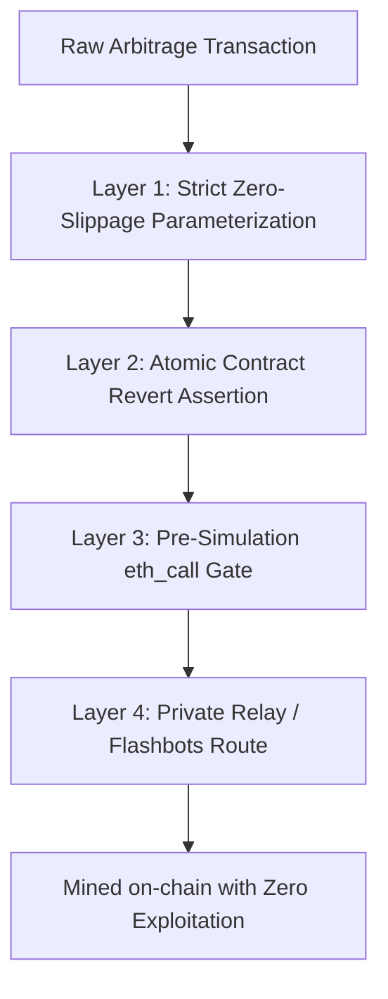

# MEV_AND_EXECUTION_RISKS.md — Adversarial MEV & Execution Hazards

> **SECURITY AXIOM**: Public blockchain mempools are hyper-adversarial environments. In unshielded mempools, any unhedged transaction showing positive net profit will be inspected, copied, or sandwiched by predatory searchers within milliseconds.

---

## 1. Adversarial MEV Threat Taxonomy

```mermaid
graph TD
    AttackVectors[MEV Threat Vectors]
    AttackVectors --> V1[Sandwich Attacks / Toxic Slippage Extraction]
    AttackVectors --> V2[Front-Running / Priority Gas Auctions (PGA)]
    AttackVectors --> V3[Mempool Sniping / Calldata Copying]
    AttackVectors --> V4[Block Reorgs & Uncles]
    AttackVectors --> V5[Stuck Nonces & Revert Gas Drain]
```

### 1.1 The Sandwich Attack Mechanism
- **How It Works**: A searcher bot detects SAHIKARA's pending swap in a public mempool (e.g. Polygon PoS).
  1. **Front-Run**: The searcher submits a high-gas buy order directly before SAHIKARA's transaction, driving the pool price up to the exact maximum allowable slippage limit configured in our transaction.
  2. **Victim Execution**: SAHIKARA's swap executes at the worst possible execution price, exhausting the entire profit margin.
  3. **Back-Run**: The searcher immediately submits a sell order directly behind our transaction, extracting the spread into their own wallet.
- **Economic Consequence**: SAHIKARA suffers an immediate negative yield, turning an expected $+0.5\%$ profit into a $-0.3\%$ loss.

### 1.2 Calldata Copying & Generalized Front-Running
- **How It Works**: Predatory MEV searchers run generalized front-running bots. When our transaction calldata interacts with a DEX pool, the bot intercepts the transaction from the mempool, simulates it with their own wallet address as the recipient, and broadcasts it with a higher validator tip (Priority Fee), claiming the arbitrage profit before our transaction is mined.
- **Economic Consequence**: Our transaction executes second and **reverts**, burning $100\%$ of our gas fee while earning ₹0.

---

## 2. Chain-Specific MEV Profiles

| Chain | Mempool Model | Primary MEV Threat | Recommended Defensive Mechanism |
| :--- | :--- | :--- | :--- |
| **Polygon PoS** | Public P2P Mempool | Sandwich attacks, Front-running, Reverts | Route via **FastLane Relay** or private RPCs; enforce strict zero-slippage bounds. |
| **Base** | Private FIFO Sequencer | Latency racing to sequencer endpoint | Minimal public mempool sandwich risk; optimize local serialization latency. |
| **Arbitrum One**| Private FIFO Sequencer | Latency racing (Time-Boost planned) | Sub-second latency competition; public sandwiching non-existent. |
| **BNB Chain** | Public Mempool | Intense validator tip gas auctions | Extremely hostile to unshielded searchers; high revert costs. |

---

## 3. Comprehensive Defensive Architecture

To protect capital and guarantee that no transaction is exploited, SAHIKARA implements an end-to-end multi-layer defense:



### Defense Layer 1: Hyper-Tight Slippage Parameterization
- Never submit transactions with loose slippage tolerances (e.g., standard $0.5\%–1.0\%$ default on Uniswap).
- The `minAmountOut` parameter passed to the contract must equal **$99.9\%$ of the exact simulated output** ($S_{\text{max}} \le 0.10\%$).
- If a sandwich bot attempts to push the price even by $0.15\%$, the transaction reverts immediately, starving the attacker of profit.

### Defense Layer 2: Atomic Contract Guardrails
- Smart contracts (`ArbitrageExecutor.sol`) will never execute multi-hop swaps across multiple separate transactions.
- The entire cycle is bundled into a **single atomic transaction**:
  ```solidity
  require(finalBalance >= initialBalance + minProfitRequired, "INSUFFICIENT_PROFIT");
  ```
- If the required profit hurdle is not met, the entire call reverts, protecting $100\%$ of principal capital.

### Defense Layer 3: Mandatory Pre-Simulation (`eth_call`)
- The Executor must execute an `eth_call` dry-run against the latest block state immediately before transaction broadcast.
- If the simulation latency exceeds $150\text{ ms}$, the opportunity is considered stale and discarded without submitting to the network.

### Defense Layer 4: Private Relay Submission
- On public mempool chains (Polygon PoS), evaluate routing through **FastLane** or dedicated private endpoints (e.g. Flashbots Protect / MEV-Share equivalents where supported) to bypass the public mempool entirely.
- Transactions submitted to private relays are hidden from searchers and cannot be sandwiched.

---

## 4. Operational Hazards & Recovery Protocols

### 4.1 Nonce Management & Stuck Transactions
- **Hazard**: A transaction submitted with too low a priority fee remains pending in a validator pool during a sudden gas price spike, blocking all subsequent nonces.
- **Defensive Protocol**:
  - Maintain an off-chain nonce tracker independent of RPC `eth_getTransactionCount`.
  - Enforce a **6-second transaction timeout**: If a transaction is not included within 3 blocks (~6 seconds on Polygon/Base), the Executor broadcasts a replacement transaction with the identical nonce, $0$ value transfer to self, and a $+30\%$ priority fee to immediately unblock the pipeline.

### 4.2 Block Reorganization (Reorg) Resilience
- **Hazard**: A short reorg (1–2 blocks on Polygon) can un-mine a transaction or reorder swaps, altering pool balances.
- **Defensive Protocol**:
  - The Scanner must listen to block reorganization events (`chainHead` regressions) and immediately purge the in-memory pool state cache, forcing a fresh fetch of pool reserves before emitting new opportunities.
