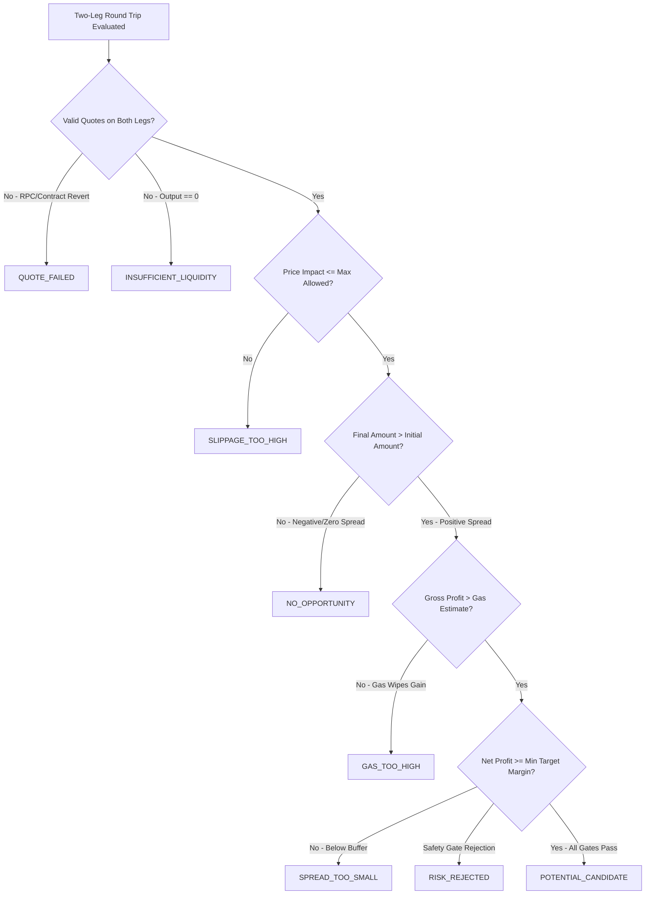

# SAHIKARA — Opportunity Classification Standard

> **STATUS**: RATIFIED (Phase 1F)
> **SCOPE**: Defines the taxonomy and evaluation gates for cross-DEX round-trip arbitrage observations.
> **SECURITY INVARIANT**: SAHIKARA execution remains LOCKED. A candidate classification is strictly a research signal and never triggers execution.

---

## 1. Taxonomic Hierarchy

Every round-trip route evaluation across registered pools is classified into exactly one of eight mutually exclusive deterministic categories:

---

## 2. Classification Definitions & Gates

### 1. `NO_OPPORTUNITY`
- **Definition**: The gross round-trip difference (`leg2Output - initialAmount`) is less than or equal to zero.
- **Economic Reality**: Quoted prices across the two pools are either in equilibrium or reverse arbitrage would lose money immediately on swap friction.
- **Action**: Recorded for statistical distribution and baseline tracking.

### 2. `SPREAD_TOO_SMALL`
- **Definition**: The gross spread is positive (`grossRoundTripDiff > 0n`), but the expected net profit (`netExpectedProfitUsd`) falls below the minimum viable threshold (`minNetProfitUsd`, default $0.05).
- **Economic Reality**: A microscopic dislocation exists, but it is insufficient to justify execution risk or overcome minor margin requirements.
- **Action**: Recorded to measure spread compression and market efficiency over time.

### 3. `QUOTE_FAILED`
- **Definition**: An adapter call to a pool's Quoter contract reverted (e.g. invalid tick, pool uninitialized, RPC timeout, or rate limit).
- **Economic Reality**: Executable quote could not be deterministically confirmed at the evaluated block.
- **Action**: Monitored for adapter reliability, RPC health, and pool state.

### 4. `INSUFFICIENT_LIQUIDITY`
- **Definition**: A leg adapter returned 0 units out or reported that pool depth cannot support the requested trade size without total slippage.
- **Economic Reality**: Trade size exceeds the pool's active tick or liquidity depth.
- **Action**: Flagged to bound maximum trade sizes per pair.

### 5. `GAS_TOO_HIGH`
- **Definition**: The gross spread is positive, but the estimated 2-hop atomic execution gas cost (`gasCostUsd`) is greater than or equal to the gross profit (`grossProfitUsd`).
- **Economic Reality**: An arbitrage dislocation exists on-chain, but execution costs on L2 consume 100%+ of the economic gain.
- **Action**: Useful metric for studying gas-sensitivity and minimum viable trade size.

### 6. `SLIPPAGE_TOO_HIGH`
- **Definition**: The estimated price impact across either leg exceeds the configured safety limit (`maxPriceImpactBps`, default 100 bps / 1.0%).
- **Economic Reality**: High price impact indicates trade size would move the AMM price unfavorably during execution.
- **Action**: Rejection prevents hazardous trades during thin liquidity spikes.

### 7. `RISK_REJECTED`
- **Definition**: The opportunity satisfied gross spread and gas requirements, but failed a secondary risk check (e.g. pool balance volatility, token contract warning, or stale block height).
- **Economic Reality**: Anomaly detection flagged the pool as unsafe.
- **Action**: Preserved for audit inspection.

### 8. `POTENTIAL_CANDIDATE`
- **Definition**: The deterministic model verified:
  1. Valid executable quotes received on both legs.
  2. `grossRoundTripDiff > 0n`.
  3. `grossProfitUsd > gasCostUsd`.
  4. `netExpectedProfitUsd >= minNetProfitUsd` after subtracting gas and risk buffer.
  5. `priceImpactBps <= maxPriceImpactBps`.
- **CRITICAL CLARIFICATION**:
  - `POTENTIAL_CANDIDATE` means: "The mathematical model observed a positive theoretical executable result under configured assumptions."
  - It does **NOT** mean: "This trade will make money in live execution."
  - It does **NOT** trigger trade submission.
  - Zero execution occurs.

---

## 3. Transparency Directive on Candidate Observations
Under no circumstances may a single `POTENTIAL_CANDIDATE` observation be used to conclude that "arbitrage is solved" or "arbitrage is easy". A candidate must be tracked across multiple blocks, tested for persistence, and evaluated against mempool competition in future research phases.
