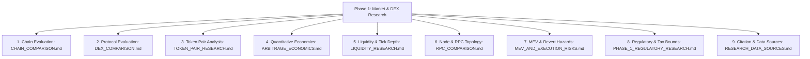

# PHASE_1_RESEARCH_PLAN.md — Phase 1 Market & DEX Research Plan

> **PHASE STATUS**: ACTIVE (PHASE 1A — INITIALIZATION)  
> **OPERATIONAL CONSTRAINT**: Strictly non-executing research. No scanner implementation, no live trading, no production wallet, no dependencies.  
> **EVIDENCE STANDARD**: All findings must be backed by authoritative sources, verifiable data, and reproducible methodology.

---

## 1. Executive Mission & Scope

The objective of **Phase 1 (Market & DEX Research)** is to establish an empirical, mathematical, and infrastructural foundation before writing a single line of scanner or execution code.

The core question Phase 1 must answer is:
> **"Does a statistically robust, economically viable cross-DEX spatial arbitrage opportunity set exist for micro-capital (starting envelope: ₹100 / ~$1.20 USD) on low-fee EVM environments after deducting all layers of friction, latency, and MEV competition?"**

If the answer is **NO** under direct micro-capital without leverage/flash loans, Phase 1 must honestly establish the minimum viable capital hurdle or architectural pivot (e.g. Flash Swaps in Phase 5+) rather than fabricating false viability.

---

## 2. Research Workstreams & Deliverable Structure

Phase 1 is divided into 9 discrete analytical workstreams, each generating a dedicated canonical document in the repository:

### Workstream Overview

| Workstream | Output Document | Primary Objective |
| :--- | :--- | :--- |
| **1. Chains** | [`CHAIN_COMPARISON.md`](./CHAIN_COMPARISON.md) | Evaluate Polygon PoS, Base, Arbitrum One, Optimism, and BNB Chain on cost, block time, finality, and MEV. |
| **2. DEXs** | [`DEX_COMPARISON.md`](./DEX_COMPARISON.md) | Profile Uniswap (v2/v3), QuickSwap, SushiSwap, Curve, Aerodrome, and PancakeSwap on fee tiers and AMM math. |
| **3. Token Pairs** | [`TOKEN_PAIR_RESEARCH.md`](./TOKEN_PAIR_RESEARCH.md) | Analyze USDC, USDT, WETH, WMATIC/POL, and WBTC pairs for spread persistence, volume, and transfer friction. |
| **4. Economics** | [`ARBITRAGE_ECONOMICS.md`](./ARBITRAGE_ECONOMICS.md) | Model the complete net profit equation against ₹100 capital across all friction layers. |
| **5. Liquidity** | [`LIQUIDITY_RESEARCH.md`](./LIQUIDITY_RESEARCH.md) | Evaluate constant-product depth vs. concentrated liquidity ticks and price impact curves. |
| **6. Infrastructure** | [`../infrastructure/RPC_COMPARISON.md`](../infrastructure/RPC_COMPARISON.md) | Benchmark RPC/WebSocket latency, rate limits, tier costs, and failover topologies. |
| **7. Adversarial Risks**| [`../security/MEV_AND_EXECUTION_RISKS.md`](../security/MEV_AND_EXECUTION_RISKS.md) | Map out mempool front-running, sandwich attacks, private RPC options, and revert penalties. |
| **8. Compliance** | [`../legal/PHASE_1_REGULATORY_RESEARCH.md`](../legal/PHASE_1_REGULATORY_RESEARCH.md) | Map India VDA tax laws (30% tax, 1% TDS), reporting mandates, and regulatory risks (Research only). |
| **9. Data Sources** | [`RESEARCH_DATA_SOURCES.md`](./RESEARCH_DATA_SOURCES.md) | Register official documentation, chain explorers, indexing APIs, and citation logs. |

---

## 3. Epistemological Framework: Separation of Truth Tiers

To maintain strict scientific rigor and eliminate wishful thinking or hallucination, all Phase 1 research notes must tag claims according to five formal truth tiers:

1. **`[FACT]`**: Empirically verified or formally defined on-chain parameter (e.g., "Polygon block time target is ~2.0 seconds", "Uniswap v3 5 bps fee tier charges 0.05% per swap"). Must cite an official primary source.
2. **`[ASSUMPTION]`**: A working premise taken as true for initial modeling (e.g., "Assume RPC round-trip latency is 120 ms from an Indian ISP"). Must be explicitly labeled as provisional.
3. **`[HYPOTHESIS]`**: A falsifiable proposition requiring testing (e.g., "Gross price divergence >0.25% between QuickSwap and Uniswap v3 persists for $>3$ seconds on WMATIC/USDC"). Must be validated in Phase 3/4.
4. **`[EXPERIMENTAL RESULT]`**: Concrete output from a logged experiment in `EXPERIMENTS.md` (e.g., "Observed 14 spread events across 10,000 blocks").
5. **`[DECISION]`**: A formal policy or architectural choice ratified in `DECISIONS.md` (e.g., `DEC-008`).

---

## 4. Phase 1 Exit Gate Criteria

Before Phase 1 can be declared complete and the project authorized to advance to Phase 2 (Scanner):

- [ ] Comprehensive comparisons completed for all 5 candidate chains and 6 candidate DEX protocols.
- [ ] Rigorous mathematical proof detailing whether ₹100 micro-capital can generate positive net expected profit under non-flash conditions on at least one candidate chain.
- [ ] Evaluation of MEV threat levels and private transaction submission availability for candidate chains.
- [ ] Verification of RPC WebSocket stability and latency limits without secret credentials.
- [ ] Comprehensive regulatory risk mapping for the Indian jurisdiction.
- [ ] Decision matrix scored with clear, evidence-based recommendations for chain and pair selection.
- [ ] Formal review and sign-off by Human Operator in `DECISIONS.md`.
