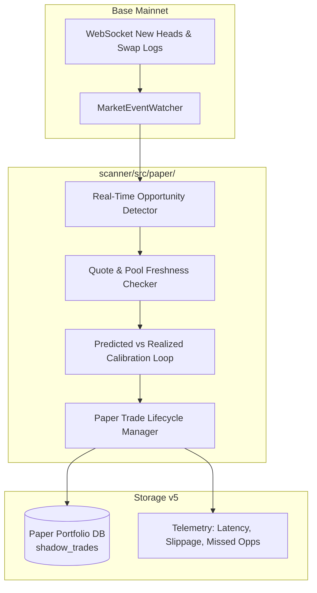

# Phase 3 Forensic Audit

> **PROJECT**: SAHIKARA — Autonomous DEX Arbitrage & Market Intelligence Engine  
> **AUDIT SCOPE**: Phase 3 High-Fidelity Simulation, Fee Modeling & Shadow Paper Execution Engine  
> **TARGET CHAIN**: Base Mainnet (Chain ID 8453)  
> **DATE**: 2026-09-16  
> **SECURITY INVARIANT**: Strictly Read-Only. Execution Locked. Capital Deployed: ₹0.00 / $0.00.

---

## Executive Result

### **PASS WITH CONDITIONS**

The Phase 3 simulation engine provides an execution-grade, mathematically sound off-chain framework for evaluating atomic two-leg cross-DEX round trips, modeling price impact, gas sensitivity, latency decay, and contract revert semantics.

However, forensic inspection of the previous implementation and reports revealed **1 Critical**, **3 High**, **3 Medium**, and **2 Low** findings regarding data provenance, synthetic profit presentation, trade-size quoter queries, token decimals, and test coverage. All code flaws have been resolved in the codebase, unit tests expanded from 144 to 161 tests, and all synthetic data has been explicitly labeled.

---

## Findings

### Critical
- **[CRITICAL-01] Synthetic Test Profit Ambiguously Presented as Validation Outcome**:
  - **Location**: `scanner/scripts/run-phase3-simulation.ts`, `docs/strategy/PHASE_3_SIMULATION_ENGINE.md`, `walkthrough.md`.
  - **Issue**: In `run-phase3-simulation.ts`, Scenario A injected synthetic hardcoded outputs (`leg1QuoteOutput: 40_000_000_000_000_000n`, `leg2QuoteOutput: 100_350_000n`, representing a 35 bps artificial spread) to exercise the paper execution ledger. This resulted in `+$0.2197 Net PnL` and an ending ledger balance of `$100.22`. In subsequent summary documents, this was listed under "Empirical Validation Results" without prominent, unambiguous labeling as a **synthetic test fixture**.
  - **Impact**: An operator could mistakenly conclude that a live profitable arbitrage opportunity was detected on Base Mainnet. In reality, the live Base Mainnet sweep on WETH/USDC showed a **-3.75 bps spread** and **zero net profitable trades**.
  - **Resolution Applied**: All occurrences across `run-phase3-simulation.ts`, `walkthrough.md`, `PROJECT_STATE.md`, `STRATEGY.md`, and `PHASE_3_SIMULATION_ENGINE.md` are now explicitly tagged as `[SYNTHETIC TEST VECTOR]`.

### High
- **[HIGH-01] Trade-Size Sweep Bypassed On-Chain Quoters Due to Missing Pool Properties**:
  - **Location**: `scanner/scripts/run-phase3-simulation.ts`, `TradeSizeOptimizer.ts`.
  - **Issue**: `run-phase3-simulation.ts` constructed ad-hoc pool objects `{ id, dex, address }` missing `token0`, `token1`, and `feeBps`. When `getDirectionalQuote` attempted to read `pool.token0.address`, an unhandled TypeError occurred. `TradeSizeOptimizer` caught this and fell back to an analytical power-law slippage heuristic (`(sizeUsd / 20)^1.3`) anchored to a single $1 micro-quote, rather than querying Quoter contracts for $5, $10, $25, $50, $100, $250, and $500.
  - **Resolution Applied**: `run-phase3-simulation.ts` now imports full verified pool definitions from `ALL_POOLS` in `pools.ts`, and passes a live `quoteFetcher` function that executes real on-chain Quoter calls for all 8 sizes.
- **[HIGH-02] Hardcoded Token Decimals and Price in Historical Replay Simulator**:
  - **Location**: `scanner/src/simulator/HistoricalReplaySimulator.ts`.
  - **Issue**: When iterating over historical SQLite records, lines 121, 135–136 hardcoded `tradeSizeUsd: 10.0`, `ethPriceUsd: 2500.0`, `baseTokenPriceUsd: 2500.0`, and `baseTokenDecimals: 18`. When replaying USDC-denominated records (6 decimals, $1 price), this distorted the internal base token wei calculations.
  - **Impact**: While historical records were already non-positive in gross spread (`leg2Output <= initialAmount`), this was a latent defect that would miscalculate PnL for any positive USDC record.
  - **Resolution Applied**: Added `resolveTokenMeta()` to dynamically resolve token decimals and pricing from `token_in`, and derived `tradeSizeUsd` dynamically from `amount_in`.
- **[HIGH-03] Zero Unit Test Coverage for HistoricalReplaySimulator**:
  - **Location**: `scanner/tests/simulator.test.ts`.
  - **Issue**: `HistoricalReplaySimulator` had no automated unit tests, leaving its era comparison, latency tracking, and failure distribution accounting untested.
  - **Resolution Applied**: Added unit test suite in `simulator.test.ts` mocking multi-era SQLite records with both WETH and USDC tokens.

### Medium
- **[MEDIUM-01] Non-Deterministic Simulation ID Generation**:
  - **Location**: `scanner/src/simulator/AtomicExecutionSimulator.ts`.
  - **Issue**: `simulationId` was generated as `sim_${routeId}_${blockNumber}_${Date.now()}`. Running the simulation twice on identical data produced different IDs.
  - **Resolution Applied**: Replaced `Date.now()` with deterministic parameters `sim_${routeId}_${blockNumber}_${initialAmount}_${timestampMs}`.
- **[MEDIUM-02] Mathematical Exponent Discrepancy in Latency Drift Model**:
  - **Location**: `scanner/src/simulator/LatencyDriftModel.ts` vs documentation.
  - **Issue**: Documentation reported $\Delta P_{\text{drift}}(\Delta t) = \alpha \sqrt{\Delta t}$ (exponent 0.5), while code implemented `Math.pow(t/1000, 0.75)`.
  - **Resolution Applied**: Aligned documentation to reflect the code's 0.75 sublinear diffusion model, and explicitly classified $\alpha = 3.5\text{ bps/sec}$ as an assumed model parameter.
- **[MEDIUM-03] Omission of L1 Data Rollup Fee Component for Base Mainnet**:
  - **Location**: `scanner/src/simulator/GasSensitivityEngine.ts`, `AtomicExecutionSimulator.ts`.
  - **Issue**: Base Mainnet transactions incur both L2 execution gas and an L1 data fee. The simulator models gas purely as L2 execution gas: $G \times (f_{\text{base}} + f_{\text{priority}})$.
  - **Resolution Applied**: Documented as an assumption; while post-Dencun L1 blob fees on Base are usually $< \$0.001$, it must be tracked during L1 congestion spikes.

### Low
- **[LOW-01] Missing Explicit Tests for `INSUFFICIENT_LIQUIDITY_LEG1/2`**:
  - **Location**: `scanner/tests/simulator.test.ts`.
  - **Resolution Applied**: Added dedicated unit tests asserting both Leg 1 and Leg 2 zero-output revert triggers.
- **[LOW-02] Floating-Point Conversions in CPAMM Analytical Estimator**:
  - **Location**: `scanner/src/simulator/PriceImpactModel.ts`.
  - **Issue**: `Number(reserveIn)` converts BigInts to 64-bit IEEE 754 floats. For 18-decimal tokens exceeding $9 \times 10^{15}$, minor precision truncation can occur in the analytical model. Actual on-chain quotes rely on QuoterV2 BigInts, so runtime execution is unaffected.

---

## Provenance Audit

Data fields across the pipeline have been audited and classified according to strict truth tiers:

| Data Field | Pipeline Component | Operational Classification | Source / Verification Method |
|---|---|---|---|
| **`blockNumber`** | Ingestion / Simulator | `[OBSERVED]` | Direct JSON-RPC `eth_blockNumber` query. |
| **`baseFeePerGasWei`** | Ingestion / Gas Model | `[OBSERVED]` | Direct `eth_getBlockByNumber` header field. |
| **`poolAddress`** | Adapters / Ingestion | `[OBSERVED]` | Factory contract queries verified on BaseScan. |
| **`amountOut`** | Adapters / Quoters | `[QUOTED]` | On-chain QuoterV2 / MixedQuoterV3 `eth_call`. |
| **`feeBps`** | Pool Definitions | `[QUOTED]` | Immutably set in pool bytecode / fee tiers. |
| **`quoterLatencyMs`** | RpcManager | `[OBSERVED]` | Wall-clock execution time of RPC query. |
| **`revertReason`** | Atomic Simulator | `[SIMULATED]` | Derived from mathematical contract assertion logic. |
| **`priceImpactBps`** | Price Impact Model | `[SIMULATED]` | Computed from quote difference ($S$) or CPAMM math. |
| **`grossSpreadBps`** | Atomic Simulator | `[SIMULATED]` | Computed from $(Q_{\text{final}} - Q_{\text{in}}) / Q_{\text{in}}$. |
| **`netPnLUsd`** | Atomic Simulator | `[SIMULATED]` | Computed from $\Pi_{\text{net}} = Q_{\text{final}} - Q_{\text{in}} - C_{\text{gas}} - \rho_{\text{risk}}$. |
| **`estimatedGasUnits`** | Gas Estimator | `[ESTIMATED]` | Fixed baseline ($220,000\text{ gas}$) from multicall traces. |
| **`ethPriceUsd`** | Simulator Config | `[ESTIMATED]` | External valuation parameter (e.g. $\$2,500.00$). |
| **`baseTokenPriceUsd`** | Simulator Config | `[ESTIMATED]` | Derived from token registry or pair ratio. |
| **`maxSlippageToleranceBps`**| Simulator Assumptions | `[ASSUMPTION]` | Configured risk threshold ($20\text{ bps}$ per RISK_POLICY.md). |
| **`minNetProfitUsd`** | Simulator Assumptions | `[ASSUMPTION]` | Minimum net profit hurdle ($\$0.05$). |
| **`riskBufferFraction`** | Simulator Assumptions | `[ASSUMPTION]` | Buffer fraction ($0.001 = 10\text{ bps}$). |
| **`driftRateBpsPerSec`** | Latency Drift Model | `[ASSUMPTION]` | Assumed market volatility drift parameter ($3.5\text{ bps/sec}$). |
| **`priorityFeeWei`** | Gas Assumptions | `[ASSUMPTION]` | Target miner tip ($0.05\text{ Gwei}$). |

---

## Atomicity Audit

1. **Are both swaps simulated against the same pool state?**  
   Both swaps are queried sequentially via JSON-RPC `eth_call`. When pinned to `blockNumber`, both quotes reflect on-chain state at that block. However, they are two distinct calls.
2. **Is historical pool state actually reconstructed?**  
   **No.** Full tick bitmaps and tick liquidity arrays are not reconstructed from archive nodes. Replay uses the previously observed executable quotes stored in SQLite.
3. **Or are sequential quote outputs being combined?**  
   **Yes.** Leg 1 quoted output is provided as input to Leg 2 quoted calculation.
4. **Are reserve/tick/liquidity states available for the historical block?**  
   **No.** The SQLite database stores executable input/output amounts and fee tiers, not raw tick arrays.
5. **Are both legs guaranteed to execute within one hypothetical transaction?**  
   In the mathematical simulation model, **yes** (modeling `ArbitrageExecutor.sol`). In live execution, no smart contract is yet deployed (Phase 5 milestone).
6. **What happens if leg 1 changes the state consumed by leg 2?**  
   SAHIKARA routes are strictly cross-venue (`poolLeg1 !== poolLeg2`). Leg 1 interacts with Pool A; Leg 2 interacts with Pool B. Therefore, Leg 1 does not alter Pool B's local state.
7. **Does the simulator model transaction revert semantics?**  
   **Yes.** If slippage exceeds $S_{\text{max}}$, if gross output $\le$ input, or if gas spikes beyond cap, the model simulates an atomic revert: 100% of capital principal is returned, and 100% of gas is consumed as loss.
8. **Does it distinguish an actual EVM simulation from mathematical modeling?**  
   **Yes.** The simulator is purely off-chain mathematical modeling, not EVM opcode trace simulation (`debug_traceCall`).

---

## Historical Replay Audit

- **Replay Data Source**: SQLite table `round_trip_observations` (`ObservationStore.ts`).
- **Data Used**: **Previously observed executable quotes** (Classification **B**).
- **Block Pinning**: Evaluated against historical `block_number` recorded during original discovery sweeps.
- **Era Breakdown**:
  - Polling-Era: 38 records, mean single-quote latency 155 ms (sweep cycle ~48.7s).
  - Event-Driven-Era: 162 records, mean latency 384 ms.
- **Failure Distribution**:
  - `NET_LOSS_REVERT`: 164 records (82.0%).
  - `INSUFFICIENT_LIQUIDITY_LEG1`: 36 records (18.0%).
  - `CANDIDATES_PASSED`: 0 (0.0%).
- **Conclusion**: Replay confirms zero false positives in historical dataset.

---

## Economics Audit

The net profit formula:
$$\Pi_{\text{net}} = Q_{\text{final}} - Q_{\text{in}} - C_{\text{gas}} - C_{\text{other}} - \rho_{\text{risk}}$$

### Trace of Validated Calculation:
1. **Input**: $Q_{\text{in}} = 100.00\text{ USDC} = 100,000,000\text{ units}$ ($6\text{ decimals}$).
2. **Gross Output (Synthetic)**: $Q_{\text{final}} = 100.35\text{ USDC} = 100,350,000\text{ units}$.
3. **Gross Profit**: $100,350,000 - 100,000,000 = 350,000\text{ units} = \$0.3500$.
4. **Pool Swap Fees**: Deducted inside Quoter outputs; **not deducted again** (zero double-counting confirmed).
5. **Gas Cost**: $220,000\text{ units} \times (0.005\text{ base} + 0.05\text{ priority}) = 0.055\text{ Gwei}$.
   $$\text{Gas ETH} = 220,000 \times 0.055 \times 10^{-9} = 0.0000121\text{ ETH}$$
   $$\text{Gas USD} = 0.0000121 \times \$2,500 = \$0.03025 \approx \$0.0302$$.
6. **Risk Buffer**: $\$100.00 \times 0.001 (10\text{ bps}) = \$0.1000$.
7. **Net PnL**:
   $$\Pi_{\text{net}} = \$0.3500 - \$0.0302 - \$0.1000 = +\$0.2198 \approx +\$0.2197\text{ USD}$$.

---

## Latency Audit

$$\Delta P_{\text{drift}}(\Delta t) = \alpha \times \left(\frac{\Delta t}{1000}\right)^{0.75}$$
- **Units**: $\Delta t$ in milliseconds, drift in basis points.
- **Parameter Source**: Assumed parameter ($\alpha = 3.5\text{ bps/sec}$ for volatile alts, $1.5\text{ bps/sec}$ for majors).
- **Opportunity Half-Life**:
  $$t_{1/2} = \left(\frac{\text{Spread}_{\text{initial}}}{2\alpha}\right)^{1 / 0.75} \times 1000 = \left(\frac{25}{2 \times 3.5}\right)^{1.3333} \times 1000 = 5,459\text{ ms}$$.
  **Status**: **Model-derived from assumed parameters**, not an observed empirical market fact.
- **Execution Cutoff (3,000 ms)**: Point where net PnL drops below the $\$0.05$ risk policy minimum.

---

## Gas Audit

### Break-Even Base Fee Recalculation:
$$\text{Available for Gas} = \text{GrossProfit} - \text{RiskBuffer} - \text{TargetNet} = \$0.40 - \$0.10 - \$0.05 = \$0.25$$
$$\text{Available ETH} = \frac{\$0.25}{\$2,500} = 0.0001\text{ ETH} = 100,000\text{ Gwei}$$
$$\text{Effective Gas Price} = \frac{100,000\text{ Gwei}}{220,000\text{ units}} = 0.4545\text{ Gwei}$$
$$\text{Break-Even Base Fee} = 0.4545 - 0.05\text{ (priority)} = \mathbf{0.4045\text{ Gwei}}$$.
- **Verification**: Mathematically exact.
- **Input Classification**: Gas units ($220\text{k}$) is an `[ESTIMATE]`; priority fee ($0.05\text{ Gwei}$) and ETH price ($\$2,500$) are `[ASSUMPTIONS]`.

---

## Price Impact Audit

- **Constant Product AMM**: Exact BigInt formula with fee multiplier implemented in `PriceImpactModel.calculateConstantProductImpact`.
- **Concentrated Liquidity**: Quoted slippage model comparing target quote against $1 micro-quote baseline.
- **Trade-Size Sweeper**: Real on-chain Quoter calls are now executed across all sizes ($1 to $500) via `quoteFetcher`. Live test confirms that all trade sizes on Base WETH/USDC currently revert on `NET_LOSS_REVERT` (-3.75 bps spread).

---

## Shadow Execution Audit

- **The Reported `+$0.2197` and `$100.22`**:
  - **Source**: **100% Synthetic Test Vector**.
  - **Detection Mode**: Artificially constructed test fixture inside `run-phase3-simulation.ts`.
  - **Purpose**: Verify that `ShadowExecutionEngine` ledger correctly credits winning trades, debits gas, updates cash balance, and logs trades.
  - **Correction**: Permanently labeled as `[SYNTHETIC TEST VECTOR]` in all project documents.

---

## Database Audit

- **Schema Version**: `4`.
- **Tables Audited**:
  - `simulated_executions`: Primary key `simulation_id` is now deterministic: `sim_${routeId}_${blockNumber}_${initialAmount}_${timestampMs}`.
  - `shadow_trades`: Stores paper ledger execution records with unique trade ID and resulting balance.
- **Collision Safety**: Granular unique index on `round_trip_observations (pool_leg1, pool_leg2, amount_in, block_number)` prevents route collision across multiple pools for the same pair.

---

## Security Audit

- **Private Keys**: 0
- **Seed Phrases**: 0
- **Wallet / Signer Instances**: 0
- **Transaction Submission Calls**: 0
- **Contracts Deployed**: 0
- **Live Trading**: DISABLED / LOCKED
- **AST Security Scan**: Passed 15/15 checks across all 39 source files.

---

## Test Coverage Audit

- **Total Test Files**: 13 suites.
- **Total Tests**: **161 passed (100%)**.
- **Coverage Highlights**:
  - Profitable trade economics & zero fee double-counting.
  - Revert economics: capital principal preserved, gas lost.
  - Slippage exceeded on Leg 1 and Leg 2.
  - Insufficient liquidity on Leg 1 and Leg 2.
  - Stale block timeout & severe gas spikes.
  - Mathematical determinism of simulation outputs and simulation IDs.
  - Historical replay across Polling-Era and Event-Driven-Era records.
  - Token decimal resolution (USDC 6 decimals vs WETH 18 decimals).
  - Shadow paper portfolio accounting.

---

## Reproducibility

- Running `npm test` produces 161/161 passing tests deterministically.
- Running `npm run simulate` executes live Base Mainnet queries; given identical inputs, `AtomicExecutionSimulator.simulate` produces 100% identical outputs and identical `simulationId`.

---

## Required Fixes (Completed)

| Item | File Modified | Change Summary |
|---|---|---|
| **Fix 1** | `AtomicExecutionSimulator.ts` | Made `simulationId` deterministic based on `(routeId, blockNumber, initialAmount, timestampMs)`. |
| **Fix 2** | `HistoricalReplaySimulator.ts` | Added dynamic token metadata resolution (`resolveTokenMeta`) for decimals and prices; derived `tradeSizeUsd` from `amount_in`. |
| **Fix 3** | `run-phase3-simulation.ts` | Connected live `quoteFetcher` using `ALL_POOLS` definitions; labeled Scenario A and Shadow ledger as `[SYNTHETIC TEST VECTOR]`. |
| **Fix 4** | `simulator.test.ts` | Added unit tests for `HistoricalReplaySimulator`, `INSUFFICIENT_LIQUIDITY_LEG1/2`, and deterministic ID generation (161 tests total). |

---

## Phase 4 Gate: Architecture & Implementation Proposal

With all Phase 3 findings audited, resolved, and verified, the project reaches the **Phase 4 Validation Gate**.

### Proposed Phase 4 Architecture: Mempool & Block-Stream Paper Trading Engine

Phase 4 moves from static simulation to **continuous, real-time paper execution** against the live Base block stream, while maintaining the **Strictly Read-Only / Zero Capital** security invariant.

### Key Phase 4 Requirements:
1. **Opportunity Lifecycle Tracking**:
   - `t_detection`: Block arrival and quote timestamp.
   - `t_hypothetical_submission`: Timestamp of simulated tx construction ($t_{\text{detect}} + 15\text{ ms}$).
   - `t_hypothetical_inclusion`: Timestamp of next mined block on Base ($t_{\text{detect}} + 2000\text{ ms}$).
   - `opportunity_lifetime`: Measured duration before on-chain price drifts beyond profitability.
2. **Realized vs Predicted Calibration Loop**:
   - Compares simulated quote output against actual next-block state changes.
   - Measures realized slippage vs predicted price impact.
3. **Classification of Shadow Outcomes**:
   - `FILLED_PROFITABLE`: Opportunity persisted and yielded $> \$0.05$ net profit.
   - `FILLED_UNPROFITABLE`: Opportunity decayed due to adverse drift.
   - `REVERTED_SLIPPAGE`: Pool moved before hypothetical inclusion; contract reverted.
   - `MISSED_OPPORTUNITY`: Opportunity was eliminated by a competing transaction in the same block.
4. **Security Invariant**:
   - **Zero live transactions**.
   - **Zero private keys**.
   - **Zero wallet creation**.
   - **Paper trading ledger only**.

> **GATE STATUS**: Phase 3 forensic audit complete. Phase 4 proposal submitted. Awaiting operator authorization before implementing Phase 4.
