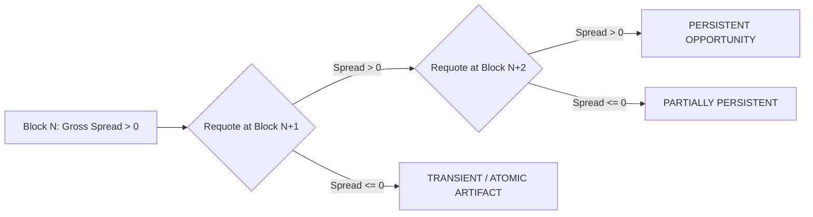

# PHASE 4.12: Multi-Block Signal Persistence Dossier

## 1. Persistence Verification Architecture

A fundamental limitation of single-block arbitrage observations is vulnerability to **transient micro-state fluctuations** or **unexecutable builder ordering artifacts**. A spread that vanishes in the subsequent block cannot be captured by non-builder searchers without sub-millisecond sequencer access.

Phase 4.12 mandates the **Multi-Block Persistence Protocol**:
For any observed candidate displaying gross-positive spread ($\text{grossDiff} > 0$) at block $N$:
1. The engine immediately queries consecutive blocks $N+1$ and $N+2$ for the identical route and trade size.
2. The state of all constituent pools is measured at each block height.
3. Signal persistence is formally categorized:
   - **`PERSISTENT`**: The spread remains gross-positive across at least 2 consecutive blocks ($N \to N+1$).
   - **`TRANSIENT`**: The spread collapses to negative or zero at block $N+1$ (reverted or captured by preceding transaction).
   - **`UNKNOWN`**: Node dropped state or rate-limiting prevented multi-block verification.

---

## 2. 10-Stage Positive Signal Gate

No observed signal is designated an "arbitrage opportunity" without surviving all 10 verification stages:

1. **Stage 1**: Positive gross spread observed ($\text{amountOut}_{\text{final}} > \text{amountIn}_{\text{initial}}$).
2. **Stage 2**: Independent protocol quote cross-check validation ($\le 0.5$ bps tolerance).
3. **Stage 3**: Verification of non-double-counted pool fees.
4. **Stage 4**: L1 + L2 execution gas cost calculation.
5. **Stage 5**: Price impact and slippage bounds check ($< 100$ bps).
6. **Stage 6**: Mandatory risk buffer deduction ($10$ bps / 0.1% buffer).
7. **Stage 7**: Independent fresh requote at current head state.
8. **Stage 8**: Multi-block persistence check ($N, N+1, N+2$).
9. **Stage 9**: Minimum reserve liquidity verification.
10. **Stage 10**: Adapter invariant and decimal forensic audit.

**Revalidation Rule**: Only candidates surviving all 10 stages receive the classification `REVALIDATED`.
