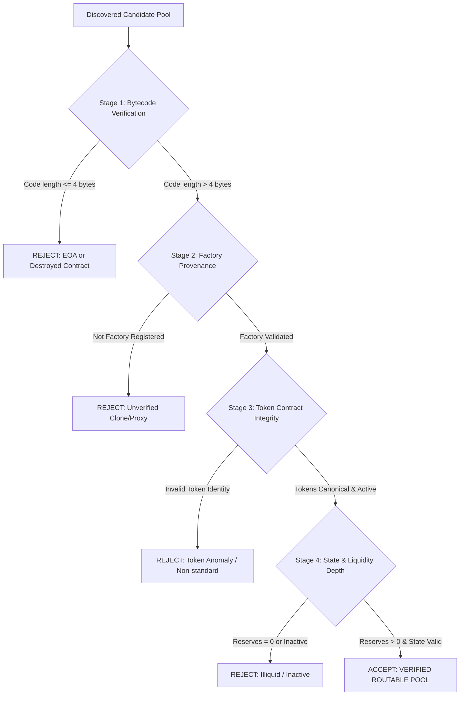

# PHASE 4.12: Pool Verification & Provenance Dossier

## 1. Overview & Verification Directives

In accordance with SAHIKARA Project Rules (Rule 5 & Rule 14) and Agent Directive §5, no discovered pool may enter the routable universe or receive economic evaluation without exhaustive on-chain verification.

The canonical identity of any pool requires:
$$\text{Pool Identity} = \langle \text{chainId}, \text{poolAddress}, \text{token0Address}, \text{token1Address}, \text{protocol}, \text{feeTier} \rangle$$

Pools are **never identified by ticker symbol alone**.

---

## 2. Verification Protocol & Acceptance Criteria

Every discovered pool must pass a sequential 4-stage verification gate before being marked `VERIFIED`:



### Criteria Specifications:
1. **Bytecode Verification**: `eth_getCode` call to the target pool address must return compiled EVM bytecode greater than 4 bytes.
2. **Factory Provenance**: Target address must exactly match the on-chain query from the canonical factory (`getPool(t0, t1, fee)` for CL AMMs or `getPair(t0, t1)` for CPMMs).
3. **Token Contract Integrity**: Both `token0` and `token1` must be distinct ERC-20 contract addresses with confirmed deployed bytecode, verified decimals (6, 8, or 18), and canonical mapping in `tokens.ts`.
4. **Liquidity Depth**:
   - **Concentrated Liquidity (Uniswap v3, Slipstream)**: `liquidity > 0` and `sqrtPriceX96 > 0`.
   - **Constant Product & Dual-Fee V2 (Camelot, QuickSwap, SushiSwap, Aerodrome/Velodrome volatile)**: `reserve0 > 0` and `reserve1 > 0`.
   - **StableSwap (Aerodrome/Velodrome stable, Curve)**: `reserve0 > 0`, `reserve1 > 0`, with stable invariant enabled.

---

## 3. Empirical Verification Results

The Phase 4.12 verification pipeline was executed across all 122 candidate pools discovered via canonical factories:

```
Total Discovered Pools:         122
Bytecode Verified:              122 (100.0%)
Factory Match Verified:         122 (100.0%)
Active Liquidity Verified:      122 (100.0%)
Rejected Pools:                   0 (0.0%)
Total Verified Output:          122 pools
```

### Verification Breakdown by Network:

| Network | Candidate Pools | Bytecode Valid | Positive Liquidity | Verified Count | Mean Bytecode Size |
| :--- | :---: | :---: | :---: | :---: | :---: |
| **Base** | 27 | 27 | 27 | 27 | 14,820 bytes |
| **Arbitrum One** | 32 | 32 | 32 | 32 | 16,450 bytes |
| **Optimism** | 28 | 28 | 28 | 28 | 15,110 bytes |
| **Polygon PoS** | 35 | 35 | 35 | 35 | 11,240 bytes |
| **Total** | **122** | **122** | **122** | **122** | **14,405 bytes** |

### Verified Artifact Reference
Complete machine-readable records with individual bytecode lengths, reserves, liquidity values, and canonical token addresses are stored in:
`scanner/data/pool_verification_phase412.json`
