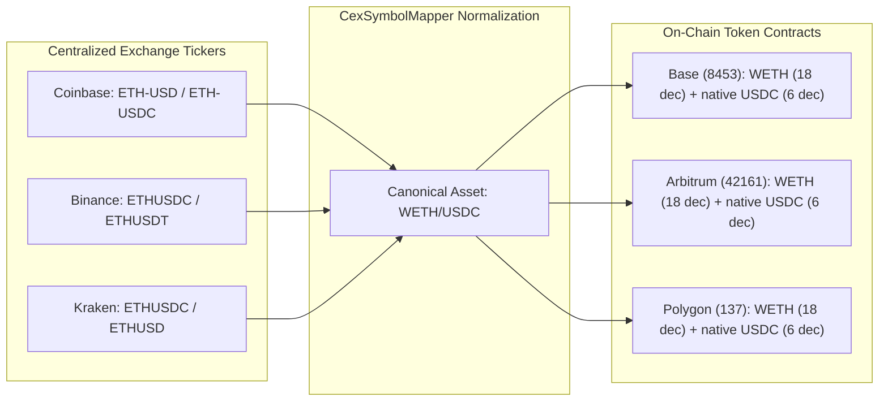

# PHASE 4.13B — Symbol Mapping & Asset Normalization Specification

> **RULE**: Never assume that identical string tickers imply identical assets across venues.

---

## 1. Asset Disambiguation Architecture

Centralized exchanges list assets by simple ticker strings (`ETH-USD`, `ETHUSDT`, `ETHUSDC`), whereas decentralized exchanges identify assets strictly by `chainId + contractAddress`.

The `CexSymbolMapper` establishes explicit, validated mappings:

---

## 2. Stablecoin Classification

| Token Identifier | Chain ID | Contract Address | Type | Valuation Parity Status |
| :--- | :--- | :--- | :--- | :--- |
| **Base USDC** | 8453 | `0x833589fCD6eDb6E08f4c7C32D4f71b54bdA02913` | Native Stablecoin | Official Circle Mint (1.0000 USD) |
| **Arbitrum USDC** | 42161 | `0xaf88d065e77c8cC2239327C5EDb3A432268e5831` | Native Stablecoin | Official Circle Mint (1.0000 USD) |
| **Arbitrum USDC.e** | 42161 | `0xFF970A61A04b1cA14834A43f5dE4533eBDDB5CC8` | Bridged Stablecoin | Deprecated bridge representation |
| **Polygon USDT** | 137 | `0xc2132D05D31c914a87C6611C10748AEb04B58e8F` | Native Tether | Tether Official Mint (1.0000 USD) |

---

## 3. Wrapped vs. Native Gas Token Invariant

1. **Operational Parity**: 1 ETH on CEX is mapped to 1 WETH on DEX via canonical `deposit()` / `withdraw()` wrap contracts (0 fee, 1:1 ratio, only gas cost).
2. **Valuation Isolation**: Reusing the Phase 4.6.1 forensic rule, `nativeGasTokenPriceUsd` (used to compute L2 gas fees) is strictly segregated from `baseTradeTokenPriceUsd` (the traded asset notional).
