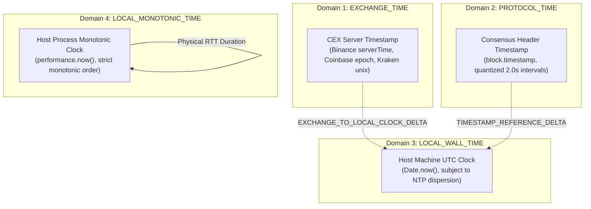

# PHASE 4.13B — Cross-Venue Timing Architecture & Clock Governance

> **MANDATE**: Enforce strict clock-domain segregation across centralized exchanges, decentralized consensus, and local host processes.

---

## 1. Multi-Clock Domain Model

Phase 4.13B extends the forensic clock architecture established in Phase 4.13A.1 to incorporate off-chain centralized exchanges:

---

## 2. Empirical Server Clock Offsets

In the Phase 4.13B live campaign, public exchange server timestamps were compared against host local wall-clock time (`Date.now()`):

| Venue | Observed Server Time | Local Wall Time | Observed Clock Delta (`local - exchange`) | RTT Duration (Monotonic) |
| :--- | :--- | :--- | :--- | :--- |
| **Coinbase** | $1789657184999\text{ ms}$ | $1789657184560\text{ ms}$ | $-439\text{ ms}$ | $376.6\text{ ms}$ |
| **Binance** | $1789657185264\text{ ms}$ | $1789657184784\text{ ms}$ | $-480\text{ ms}$ | $219.0\text{ ms}$ |
| **Kraken** | $1789657185000\text{ ms}$ | $1789657185186\text{ ms}$ | $+186\text{ ms}$ | $401.3\text{ ms}$ |

### Key Forensic Insight
These offsets vary between $-480\text{ ms}$ and $+186\text{ ms}$ across distinct platforms. This variation proves that exchange server clocks cannot be subtracted from one another or from local wall clocks to measure one-way physical transit latency. All transit metrics must be measured using the host's monotonic timer (`performance.now()`).
