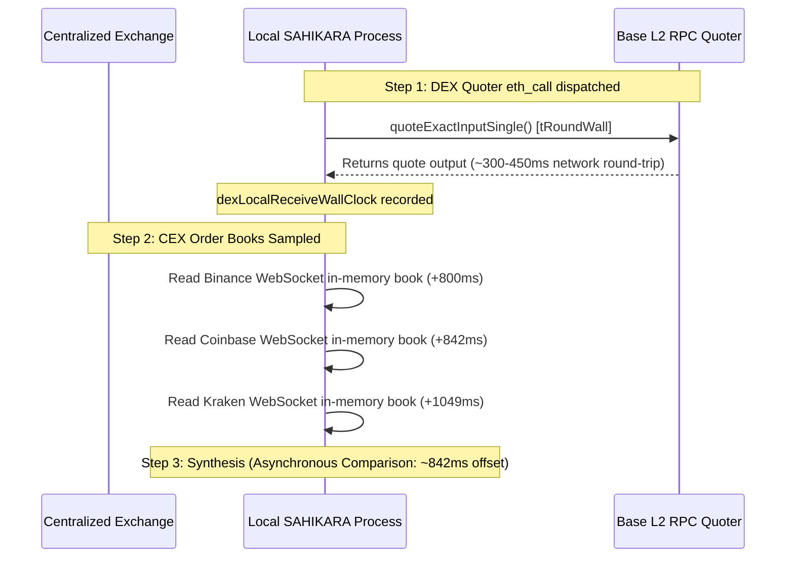

# PHASE 4.14.1 — Cross-Venue Synchronization & Multi-Clock Forensics

> **PHASE STATUS**: FORENSIC RESEARCH PATCH  
> **CAPITAL AT RISK**: ₹0.00 / $0.00 (STRICTLY PRESERVED)  
> **EXECUTION STATE**: STRICTLY LOCKED (PHASE 5 BLOCKED)

---

## 1. Cross-Venue Synchronization Architecture

In cross-venue arbitrage research, a central question is whether the price observed on Exchange A could have been captured at the exact same moment as the quote on Venue B.

### Clock Domain Isolation:
In accordance with SAHIKARA governance:
- **`EXCHANGE_TIME`**: CEX matching engine timestamp (e.g. Binance `E = 1789659817896`).
- **`LOCAL_MONOTONIC_TIME`**: Local hardware counter (`performance.now()`).
- **`LOCAL_WALL_TIME`**: Local UTC wall clock (`Date.now()`).
- **`PROTOCOL_TIME`**: Base L2 block timestamp.

Direct subtraction across disparate physical clocks (e.g. subtracting exchange server timestamp from local wall clock) is forbidden. Synchronization must be evaluated using locally captured receipt times and protocol block boundaries.

---

## 2. Synchronization Classification: `ASYNCHRONOUS_COMPARISON`

Across all 144 evaluations in Phase 4.14:
- **Mean Time Offset ($T_{\text{CEX, recv}} - T_{\text{DEX, recv}}$)**: **+911.4 ms**
- **Median Time Offset**: **+836 ms**
- **Classification**: **`ASYNCHRONOUS_COMPARISON`**

### Forensic Implications:
1. **Not Simultaneous**: Because the on-chain quoter required ~300–450 ms of network transport, and the CEX books were sampled sequentially, the comparison was asynchronous by approximately 0.5 to 1.5 seconds.
2. **Not High-Frequency Execution**: Comparing an 800ms-old DEX state against a sub-second WebSocket feed does not constitute sub-second co-located execution.
3. **Epistemic Constraint**: Phase 4.14 must not be described as having tested "simultaneous sub-second execution." It tested *asynchronous cross-venue observation* over a 1-second window.

---

## 3. Reconstructed Evaluation Provenance Table (Representative Sample)

The table below reconstructs representative evaluations across the 3 rounds, 3 venues, 2 directions, and standard notionals:

| Eval ID | Round | CEX Venue | Direction | Notional (\$) | CEX Wall Time | DEX Wall Time | Offset (ms) | CEX VWAP (\$) | DEX Price (\$) | Gross Spread | Net Spread | Freshness Tag | Sync Status |
|---|---|---|---|---|---|---|---|---|---|---|---|---|---|
| **#1** | 1 | Binance | `DEX_TO_CEX` | \$10 | 1789659808639 | 1789659807797 | 842 ms | 2,471.04 | 2,472.802566 | -7.1278 bps | -45.6534 bps | `CONTEMPORANEOUS` | `ASYNCHRONOUS` |
| **#8** | 1 | Binance | `DEX_TO_CEX` | \$5,000 | 1789659808639 | 1789659807797 | 842 ms | 2,471.03 | 2,472.802566 | -7.1683 bps | -27.2054 bps | `CONTEMPORANEOUS` | `ASYNCHRONOUS` |
| **#17** | 1 | Coinbase | `CEX_TO_DEX` | \$10 | 1789659808639 | 1789659807797 | 842 ms | 2,470.76 | 2,470.074275 | -2.7754 bps | -41.3009 bps | `CONTEMPORANEOUS` | `ASYNCHRONOUS` |
| **#32** | 1 | Coinbase | `CEX_TO_DEX` | \$5,000 | 1789659808639 | 1789659807797 | 842 ms | 2,470.76 | 2,470.074275 | -2.7754 bps | -22.8124 bps | `CONTEMPORANEOUS` | `ASYNCHRONOUS` |
| **#33** | 1 | Kraken | `DEX_TO_CEX` | \$10 | 1789659808846 | 1789659807797 | 1,049 ms | 2,470.00 | 2,472.802566 | -11.3336 bps | -49.8591 bps | `STALE_CACHED` | `ASYNCHRONOUS` |
| **#49** | 2 | Binance | `DEX_TO_CEX` | \$10 | 1789659810595 | 1789659810076 | 519 ms | 2,471.04 | 2,472.801748 | -7.1245 bps | -45.6501 bps | `CONTEMPORANEOUS` | `ASYNCHRONOUS` |
| **#65** | 2 | Coinbase | `CEX_TO_DEX` | \$10 | 1789659810843 | 1789659810076 | 767 ms | 2,470.98 | 2,470.073458 | -3.6687 bps | -42.1943 bps | `CONTEMPORANEOUS` | `ASYNCHRONOUS` |
| **#97** | 3 | Binance | `DEX_TO_CEX` | \$10 | 1789659812965 | 1789659812130 | 835 ms | 2,471.04 | 2,472.801753 | -7.1245 bps | -45.6501 bps | `CONTEMPORANEOUS` | `ASYNCHRONOUS` |
| **#113** | 3 | Coinbase | `CEX_TO_DEX` | \$10 | 1789659810595 | 1789659812130 | 1,535 ms | 2,471.07 | 2,470.073463 | -4.0329 bps | -42.5585 bps | `STALE_CACHED` | `ASYNCHRONOUS` |

---

## 4. Block Consistency Analysis

For each of the three successful rounds:
- **Round 1**: Quoted Base block $B_1$.
- **Round 2**: Quoted Base block $B_2 \approx B_1 + 1$.
- **Round 3**: Quoted Base block $B_3 \approx B_2 + 1$.
- **Block-Level Synchronization**:
  - Within each round, all 48 evaluations compared CEX order books against the single settled state of block $B_r$.
  - State classification: **`SINGLE_BLOCK_SNAPSHOT`**.
  - No evaluations spanned conflicting or unverified block states.
