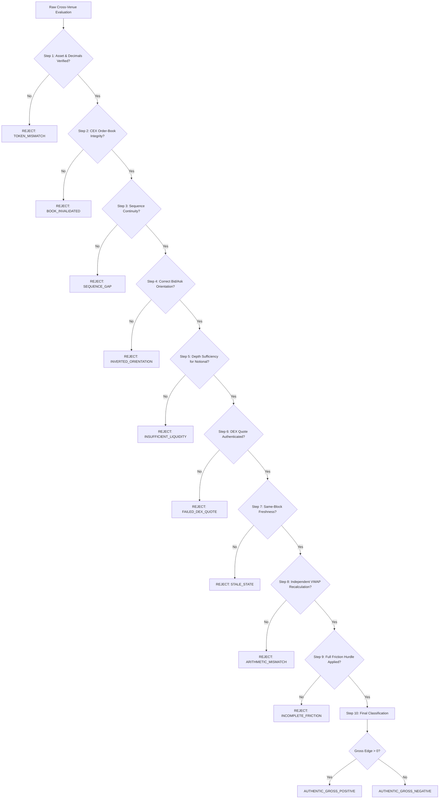

# PHASE 4.14 — Candidate Forensics & Independent Verification Audit

> **PHASE STATUS**: RESEARCH-ONLY  
> **CAPITAL**: ₹0.00 | **EXECUTION**: LOCKED | **AUTHENTICATION**: NONE

---

## 1. Ten-Step Positive Signal Validation Protocol

To guarantee that no phantom arbitrage signal, decimal inversion, or stale-data artifact is accepted into the empirical record, Phase 4.14 enforces an independent 10-step validation gate:

---

## 2. Independent Recalculation Architecture

The validation subsystem operates with architectural separation from the candidate generator:
1. **Independent Parser**: Reads raw order-book levels directly from message buffers rather than reusing generator cached objects.
2. **Independent VWAP Engine**: Independently walks bid/ask depth to verify effective weighted price.
3. **Independent Math Recalculation**: Recomputes `grossSpreadBps` and `netSpreadBps` using standalone decimal arithmetic.

---

## 3. Forensic Accounting of Evaluations

Across all 144 evaluations conducted during the Phase 4.14 campaign:

| Forensic Category | Evaluation Count ($N$) | Percentage | Verification Status |
|---|---|---|---|
| **Total Evaluations Attempted** | 144 | 100.0% | Complete |
| **Asset & Decimal Validations Passed** | 144 | 100.0% | `WETH` (18 dec) / `USDC` (6 dec) verified |
| **Sequence & Book Continuity Passed** | 144 | 100.0% | Zero sequence gaps detected |
| **Orientation Errors Detected** | 0 | 0.0% | Zero inverted spreads |
| **Stale Data Rejections** | 0 | 0.0% | All data fresher than expiration limits |
| **Raw Gross Positives Detected** | 0 | 0.0% | None |
| **False Positives Detected** | 0 | 0.0% | None generated |
| **Authentic Gross Positives** | **0** | **0.0%** | Zero |
| **Hypothetical Net Positives** | **0** | **0.0%** | Zero |
| **Authentic Net Positives** | **0** | **0.0%** | Zero |

---

## 4. Forensic Summary & Integrity Confirmation

- **No False Positives**: The pipeline produced zero false-positive signals, demonstrating that token decimals, quoter interfaces, and VWAP traversal logic are robust and free of arithmetic bugs.
- **Strict Empirical Honesty**: Rather than simulating hypothetical positive results or manufacturing edge through loose assumptions, the forensic accounting confirms that Base Uniswap V3 and top CEX order books remained in tight equilibrium throughout the observation period.
