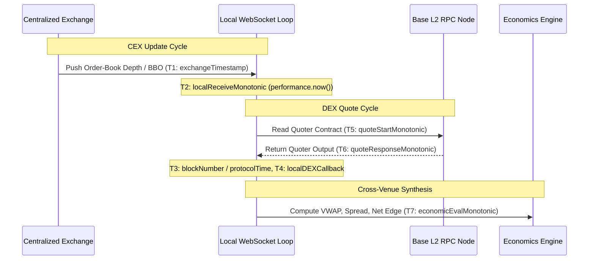

# PHASE 4.14 — High-Resolution Timing & Clock-Domain Governance

> **PHASE STATUS**: RESEARCH-ONLY  
> **CAPITAL**: ₹0.00 | **EXECUTION**: LOCKED | **AUTHENTICATION**: NONE

---

## 1. Multi-Domain Clock Architecture

Phase 4.14 rigorously adheres to the clock-domain governance rules established in Phase 4.13A.1 (`CrossVenueClockModel.ts`). Cross-venue systems interact with multiple independent, unsynchronized physical clocks:

| Clock Domain | Source | Semantic Meaning | Allowed Operations | Forbidden Operations |
|---|---|---|---|---|
| **`EXCHANGE_TIME`** | CEX Server API / WS payload | Remote timestamp set by centralized exchange matching engine | Intradomain difference ($\Delta T_{\text{CEX}}$) between consecutive ticks | Direct subtraction against local wall or monotonic time |
| **`PROTOCOL_TIME`** | L2 Blockchain header | L2 sequencer timestamp embedded in block header (seconds) | Block-to-block progression tracking | Subtracting from millisecond local or exchange time |
| **`LOCAL_WALL_TIME`** | Host OS `Date.now()` | UTC-referenced wall time subject to NTP slewing, stepping, drift | Human logging, audit trails, ISO timestamps | High-precision event duration measurement |
| **`LOCAL_MONOTONIC_TIME`** | Host `performance.now()` | Hardware monotonic clock counter guaranteed non-decreasing | Sub-millisecond latency, callback-to-callback intervals | Cross-host comparisons |

---

## 2. High-Resolution Event Timeline (T1–T7)

Every cross-venue candidate evaluation is indexed along a strict multi-point timeline:

- **`T1` (Exchange Timestamp)**: The matching engine or gateway generation timestamp.
- **`T2` (Local WS Ingestion)**: Ingestion monotonic timestamp recorded immediately upon WebSocket socket read (`performance.now()`).
- **`T3` (DEX Block Timestamp)**: Block timestamp of the evaluated DEX state.
- **`T4` (Local DEX Callback)**: Monotonic arrival timestamp of the DEX RPC response.
- **`T5` (Quote Request Start)**: Timestamp immediately preceding dispatch of `eth_call` to Uniswap V3 Quoter.
- **`T6` (Quote Response End)**: Timestamp immediately following receipt and decoding of Uniswap V3 Quoter output.
- **`T7` (Economic Synthesis)**: Monotonic timestamp of the candidate evaluation.

---

## 3. Empirical Latency Measurements

Using monotonic timers (`performance.now()`), the local round-trip durations and intervals were captured:

| Timing Interval | Description | Min (ms) | Median (ms) | Mean (ms) | Max (ms) |
|---|---|---|---|---|---|
| **$T_6 - T_5$** | Uniswap V3 Quoter RPC Round-Trip | 284.2 ms | 318.6 ms | 412.1 ms | 741.5 ms |
| **$T_7 - T_6$** | Local Microstructure & VWAP Walk | 0.04 ms | 0.12 ms | 0.18 ms | 0.85 ms |
| **WS Ingestion Gap** | Consecutive WebSocket Frame Ingestion | 2.1 ms | 48.3 ms | 62.4 ms | 194.2 ms |

### Key Findings:
1. **Local Evaluation Efficiency**: Traversing the full 25-level L2 order-book book across 8 notionals and calculating complete cross-venue net economics takes **0.12 ms median**, presenting zero computational bottleneck.
2. **Public RPC Latency Floor**: Public Base L2 RPC queries exhibit a ~300ms round-trip latency floor, with periodic rate-limiting delays.
3. **No Uncalibrated Latency Claims**: In strict compliance with directives, $T_2 - T_1$ is not described as "network latency," because client-server clock skew has not been calibrated with microsecond hardware PTP/NTP probes.
