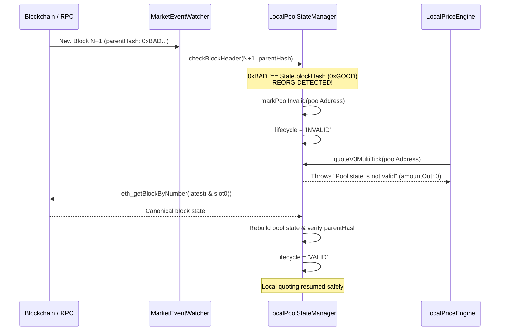

# PHASE 4.17 — Failure Modes, Reorg Handling & Fail-Closed Invariants

**Phase**: 4.17 (Production-Grade Local DEX State Reconstruction & Cross-DEX Validation)  
**Date**: 2026-09-17  
**Status**: VALIDATED  
**Capital at Risk**: ₹0.00 / $0.00  
**Phase 5 Status**: STRICTLY BLOCKED  

---

## 1. The Primacy of "Fail Closed"

A core directive of SAHIKARA is that candidate quote generation must never compromise capital security. Whenever local state cannot be established with 100% mathematical and cryptographic certainty, the local engine must **fail closed** immediately:
- Refuse to generate quotes (`amountOut = 0n`, throw error, or mark `isIncompleteState = true`).
- Stop screening candidates for affected pools.
- Transition lifecycle to `INVALID`, `INCOMPLETE`, or `RESYNC_REQUIRED`.
- Under no circumstances make heuristic guesses or interpolate missing ticks.

---

## 2. Comprehensive Failure Taxonomy & Handling

| Failure Condition | Detection Mechanism | Immediate Action | Transition State | Test Verification |
| :--- | :--- | :--- | :--- | :--- |
| **Chain Reorganization** | `newBlock.parentHash !== currentState.blockHash` | Mark state invalid; stop quoting; discard pending events | `INVALID` $\to$ `RESYNC_REQUIRED` | Unit Test 14 |
| **Block Gap** | `newBlock.number > currentState.blockNumber + 1` | Detect unobserved event gap; invalidate state | `INVALID` $\to$ `RESYNC_REQUIRED` | Unit Test 13 |
| **Out-of-Order Log** | `log.logIndex <= currentState.logIndex` at same block | Reject duplicate or stale log; log warning | Log Dropped (State Unchanged) | Unit Test 12 |
| **Duplicate Event** | Log with identical `(txHash, logIndex)` received | Detect replay from reconnect; ignore duplicate | Log Dropped (State Unchanged) | Unit Test 11 |
| **Missing Tick Data** | Traversal reaches initialized tick not in memory | Halt traversal; set `isIncompleteState = true` | `INCOMPLETE` $\to$ `RESYNC_REQUIRED` | Unit Test 17 |
| **Bitmap Inconsistency**| Bitmap bit set but tick record missing (or vice-versa) | Treat as corrupt state; reject quotes | `INVALID` $\to$ `RESYNC_REQUIRED` | Unit Test 18 |
| **Stale State** | `Date.now() - state.lastUpdatedMs > maxStalenessMs` | Disallow candidate generation | `STALE` $\to$ `RESYNC_REQUIRED` | Unit Test 19 |
| **WebSocket Reconnect** | WS connection drop followed by reconnect stream | Re-verify block continuity; resync if gap detected | `RESYNC_REQUIRED` $\to$ `VALID` | Unit Test 15 |
| **Zero/Negative Liquidity**| $L \le 0$ during swap step | Terminate traversal immediately | Quote Rejected | Unit Test 25 |
| **Public RPC Rate Limit** | HTTP 429 / `-32016` "over rate limit" error | Sequential pacing + exponential backoff retry | Transparent Retry | Production Benchmark |

---

## 3. Detailed Reorganization Detection & Recovery Flow

---

## 4. Test Suite Verification

All failure modes listed above are covered by unit and integration tests in `scanner/tests/phase417ProductionDexState.test.ts`:
- **Test 11**: Duplicate event rejection verified.
- **Test 12**: Out-of-order log rejection verified.
- **Test 13**: Block gap detection and state invalidation verified.
- **Test 14**: Parent hash mismatch reorg detection verified.
- **Test 15**: WebSocket reconnect stream reconciliation verified.
- **Test 17**: Missing tick fail-closed behavior verified.
- **Test 18**: Bitmap inconsistency fail-closed behavior verified.
- **Test 19**: Stale state rejection verified.
- **Test 25**: Invalid state fail-closed behavior verified.
