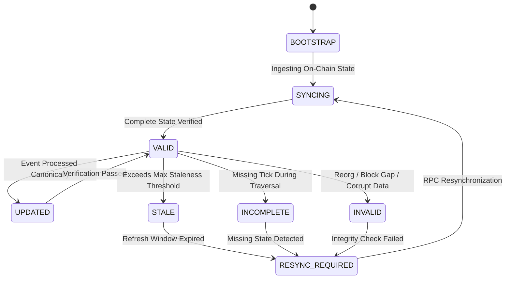

# PHASE 4.17 — Uniswap V3 Complete State Reconstruction

**Phase**: 4.17 (Production-Grade Local DEX State Reconstruction & Cross-DEX Validation)  
**Date**: 2026-09-17  
**Status**: VALIDATED  
**Capital at Risk**: ₹0.00 / $0.00  
**Phase 5 Status**: STRICTLY BLOCKED  

---

## 1. Executive Summary

Phase 4.16 established that in-memory Uniswap V3 calculations could achieve 0-wei parity with on-chain `QuoterV2` when trades remained strictly inside the pool's active tick range. However, production DEX trading demands deterministic handling of multi-tick swaps, tick boundary crossings, tick bitmap traversal, and event-driven liquidity updates.

Phase 4.17 upgraded the local Uniswap V3 state model from a simplified active-tick model into a production-grade concentrated liquidity state engine. This document establishes the complete state representation, event transition lifecycle, and synchronization invariants implemented in SAHIKARA.

---

## 2. State Model Representation

The local Uniswap V3 pool state is encapsulated within `V3PoolState` (defined in `scanner/src/dexstate/LocalPoolState.ts`):

```typescript
export interface V3PoolState {
  poolAddress: Address;
  protocol: 'uniswap-v3';
  token0: Address;
  token1: Address;
  decimals0: number;
  decimals1: number;
  fee: number; // e.g., 500 = 0.05%
  tickSpacing: number; // e.g., 10 for 500 fee tier
  sqrtPriceX96: bigint;
  tick: number;
  liquidity: bigint; // Active in-range liquidity L
  initializedTicks: Map<number, {
    tick: number;
    liquidityGross: bigint;
    liquidityNet: bigint;
    initialized: boolean;
  }>;
  tickBitmap: Map<number, bigint>; // wordPosition (int16) -> 256-bit word (uint256)
  stateVersion: number;
  blockNumber: bigint;
  blockHash: Hex;
  logIndex: number;
  parentHash?: Hex;
  lastUpdatedMs: number;
  lifecycle: StateLifecycleStatus;
}
```

### Key Components

1. **`slot0` Core**: Tracks `sqrtPriceX96` (Q64.96 fixed-point representation of $\sqrt{P}$) and active `tick`.
2. **Active `liquidity` ($L$)**: Pure BigInt integer of currently usable virtual liquidity.
3. **`initializedTicks` Map**: Indexed by exact integer tick. Each tick record contains `liquidityGross` (total liquidity referencing this boundary) and `liquidityNet` (directional change in $L$ when crossed from left to right: added when moving right, subtracted when moving left).
4. **`tickBitmap` Index**: Sparse mapping of `int16` word positions to 256-bit BigInt words. A bit is set to 1 if and only if the corresponding compressed tick has an initialized tick record ($liquidityGross > 0$).
5. **State Version & Lineage**: Monotonically incremented on every event log application, maintaining `blockNumber`, `blockHash`, and `parentHash` for deterministic reorganization detection.

---

## 3. Event-Driven State Transitions

State transitions are governed by canonical EVM event logs:

### 3.1 `Swap` Event
- **Emitted Values**: `sender`, `recipient`, `amount0`, `amount1`, `sqrtPriceX96`, `liquidity`, `tick`.
- **Local Application**: Updates `sqrtPriceX96`, active `tick`, and active `liquidity` atomically to the post-swap state.
- **Invariant**: Validates canonical block and log ordering: $(blockNumber, logIndex) > (state.blockNumber, state.logIndex)$.

### 3.2 `Mint` Event
- **Emitted Values**: `sender`, `owner`, `tickLower`, `tickUpper`, `amount`, `amount0`, `amount1`.
- **Local Application**:
  1. For `tickLower`: increments `liquidityGross += amount`, adds `liquidityNet += amount`, sets initialized bit in `tickBitmap`.
  2. For `tickUpper`: increments `liquidityGross += amount`, subtracts `liquidityNet -= amount`, sets initialized bit in `tickBitmap`.
  3. If active `tick` is currently inside $[tickLower, tickUpper)$, increments active `liquidity += amount`.

### 3.3 `Burn` Event
- **Emitted Values**: `owner`, `tickLower`, `tickUpper`, `amount`, `amount0`, `amount1`.
- **Local Application**:
  1. For `tickLower`: decrements `liquidityGross -= amount`, subtracts `liquidityNet -= amount`. If `liquidityGross == 0`, clears initialized bit in `tickBitmap`.
  2. For `tickUpper`: decrements `liquidityGross -= amount`, adds `liquidityNet += amount`. If `liquidityGross == 0`, clears initialized bit in `tickBitmap`.
  3. If active `tick` is currently inside $[tickLower, tickUpper)$, decrements active `liquidity -= amount`.

---

## 4. State Machine Lifecycle

The pool state engine enforces strict lifecycle states:



### Operational Rules
- **Fail Closed**: Any quote evaluation requested when `lifecycle !== 'VALID' && lifecycle !== 'UPDATED'` immediately throws `STATE_INCOMPLETE` or `STATE_INVALID`. No candidate quotes are emitted.
- **Zero Hallucination**: Ticks not present in the local cache are never approximated or assumed to have zero liquidity. If the swap path crosses an uninitialized or un-cached tick boundary, traversal terminates with `STATE_INCOMPLETE`.

---

## 5. Security and Operational Invariants

1. **Read-Only Operation**: Pool state acquisition uses standard `eth_call` contract views (`slot0`, `liquidity`, `ticks`, `tickBitmap`). Zero transaction credentials exist.
2. **Zero-Float Arithmetic**: All internal math is strictly performed using native `bigint` types with explicit Uniswap V3 bit-width masking ($uint160$, $uint256$, $int24$, $int128$, $uint128$).
3. **Authoritative Primacy (FAST ≠ TRUSTED)**: The local state model generates screening candidates in microseconds ($< 1.5 \text{ ms}$). All candidates must be authoritatively verified against on-chain RPC `QuoterV2` before any candidate reaches risk screening.
