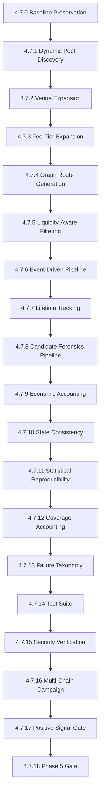

# PHASE 4.7 — OPPORTUNITY DISCOVERY EXPANSION
## Architectural Specification, Methodology & Baseline Strategy Dossier

> **CANONICAL REFERENCE**: This document governs Phase 4.7 of the SAHIKARA project. Compliance with the directives herein is mandatory for all automated agents and human contributors.
> **PHASE 5 GATE**: STRICTLY BLOCKED. Zero live execution. Zero private keys. Capital at risk: ₹0.00 / $0.00.

---

## 1. Executive Objective

The purpose of Phase 4.7 is **not** to manufacture an artificial positive arbitrage result. Rather, it is to conduct an evidence-driven, rigorously verified investigation into whether the historical absence of validated profitable arbitrage opportunities was an artifact of constrained pool, pair, venue, or fee-tier coverage.

### Primary Empirical Question
> *"Are there executable DEX arbitrage opportunities that survive actual quoting, fees, slippage, gas, latency, liquidity, and risk constraints within a broader monitored market universe?"*

If the answer remains **NO**, that outcome will be documented with radical honesty, and the economic constraints of DEX market microstructure across L2/sidechain ecosystems will be precisely quantified.

---

## 2. Starting Baseline (Phase 4.6.1.1)

| Parameter | Baseline Value | Source |
| :--- | :--- | :--- |
| **Commit Baseline** | `d619f63` (`forensics(phase-4.6): post-audit revalidation`) | Git HEAD |
| **Defects Resolved** | D-001 (CRITICAL), D-002 (HIGH), D-003 (MEDIUM) | Forensic Audit / Revalidation |
| **Verified Active Pools** | 32 pools (Base: 17, Arbitrum: 5, Optimism: 5, Polygon: 5) | `pools-*.ts` ([FACT] tier) |
| **Fee Tiers Evaluated** | Primarily 5 bps (500) and 30 bps (3000) | Phase 4.6 campaign |
| **Triangular Routes Tested** | **0** (pool topology graph lacked closed 3-token cycles) | Forensic Revalidation |
| **Apparent Signals Deconstructed** | Arbitrum (-19.96 bps gross) & Optimism (-8.46 bps gross) | Confirmed sub-fee price drift; REJECTED |
| **Historical Valid Quotes** | 1,070 valid executable quotes across 4 chains | Phase 4.6.1 campaign |
| **Positive Gross / Net Spreads** | **0** (100% classified as Tier 0) | Empirical dataset |
| **Capital at Risk** | **₹0.00 / $0.00** | Strictly enforced |
| **Execution Engine** | **STRICTLY LOCKED** | Architectural invariant |

---

## 3. Core Hypotheses

1. **Fee-Tier Topology Hypothesis ($H_1$)**:
   - *Premise*: By expanding the monitored fee tiers to include ultra-low fee tiers (1 bps / 100 on Uniswap V3, 1-tick on Slipstream) and higher fee tiers (100 bps / 10000), cross-fee-tier spread opportunities may become economically viable if volatility exceeds fee drag.
   - *Falsification Criteria*: If gross output across all fee-tier combinations ($100 \leftrightarrow 500$, $500 \leftrightarrow 3000$) remains strictly negative after accounting for pool fees ($> 6$ bps to $> 35$ bps), $H_1$ is rejected.

2. **Triangular Cycle Hypothesis ($H_2$)**:
   - *Premise*: Intra-venue or cross-venue triangular cycles ($A \to B \to C \to A$, e.g. WETH $\to$ USDC $\to$ WBTC $\to$ WETH) may exhibit transient cross-rate discrepancies that 2-hop pairs cannot capture.
   - *Falsification Criteria*: If 3-hop execution accumulates $> 45$ bps in fee drag plus $3\times$ price impact and yields negative net PnL across all trade sizes, $H_2$ is rejected.

3. **Event-Triggered Latency Hypothesis ($H_3$)**:
   - *Premise*: Apparent price divergence immediately following a large Swap or Mint/Burn event decays before an atomic transaction could execute in the subsequent block.
   - *Measurement Criteria*: Measure opportunity lifetime from `firstObservedAt` to `expiredAt`. If no opportunity ever achieves positive gross spread, report lifetime as `UNKNOWN`.

---

## 4. Phase 4.7 Workstream Breakdown

### Detailed Workstream Tasks
- **4.7.1 Dynamic Pool Discovery**: Query canonical factories for candidate pools; verify bytecode length $\ge 4$ bytes; verify token0, token1, fee tier, and active liquidity.
- **4.7.2 Venue Expansion**: Expand DEX adapters where canonical on-chain factories and quoters exist (e.g. PancakeSwap V3 on Base/Arbitrum, Camelot on Arbitrum, QuickSwap on Polygon).
- **4.7.3 Fee-Tier Expansion**: Systematically evaluate 100 (0.01%), 500 (0.05%), 3000 (0.30%), and 10000 (1.00%) fee tiers.
- **4.7.4 Graph-Based Route Discovery**: Represent verified pools as a directed multigraph; extract 2-hop, 3-hop triangular, and 4-hop multi-hop cycles; enforce canonical deduplication.
- **4.7.5 Liquidity-Aware Filtering**: Pre-filter dry or exhausted pools prior to quoting across $1–$1,000 tiers.
- **4.7.6 Event-Driven Pipeline**: Profile detection, quote, and evaluation latencies separately from block timestamps.
- **4.7.7 Opportunity Lifetime Tracking**: State machine tracking `firstPositiveAt` through `expiredAt`.
- **4.7.8 Candidate Forensics Pipeline**: 10-stage validation gate with mandatory repeat on-chain quoting before any signal can be labeled a `VALIDATED OPPORTUNITY`.
- **4.7.13 Failure Taxonomy**: Explicit 16-category taxonomy preventing error codes from polluting economic distributions.
- **4.7.16 Multi-Chain Campaign**: Sequentially execute Campaign A (Base), Campaign B (Arbitrum), Campaign C (Optimism), and Campaign D (Polygon) against isolated database `observations_phase47.db`.

---

## 5. Non-Negotiable Economic Constraints

1. **Net PnL Invariant**:
   $$\text{Net PnL} = \text{AmountOut}_{\text{final}} - \text{AmountIn}_{\text{initial}} - \text{GasCost}_{\text{USD}} - \text{OtherCosts}_{\text{USD}} - \text{RiskBuffer}_{\text{USD}}$$
2. **No Double-Counting**:
   DEX swap fees are already deducted by on-chain pool swap math (e.g. `QuoterV2`). Fees must **not** be subtracted a second time.
3. **No Synthetic Economic Pollution**:
   Reverts, timeouts, or RPC errors must **never** be logged as `-10,000` bps or any other synthetic negative spread. They must be recorded under `quote_failures` with a precise `FailureCategory`.
4. **Token Valuation Separation (D-001 Invariant)**:
   Gas token price (`nativeGasTokenPriceUsd`) and trade token price (`baseTradeTokenPriceUsd`) must never be conflated.
5. **Exact Algebraic BigInt Price Impact (D-002 Invariant)**:
   Price impact must use exact BigInt math preserving 8 decimal places:
   $$\Delta P_{\text{scaled}} = \frac{|S_{\text{after}} - S_{\text{before}}| \times (S_{\text{after}} + S_{\text{before}}) \times 10^8 \times 10000}{S_{\text{before}}^2}$$
   No `Number(sqrtPriceX96)` conversions.

---

## 6. Security Invariants & Phase 5 Gate

- **Capital at Risk**: **₹0.00 / $0.00** permanently.
- **Execution Engine**: **STRICTLY LOCKED**.
- **No Signers**: No private keys, mnemonic seeds, production wallets, or live transaction broadcasting are permitted in the codebase.
- **Phase 5 Gate**: Phase 5 (Smart Contract Development) remains **BLOCKED**. Under no circumstances will Phase 5 be initiated during Phase 4.7.
