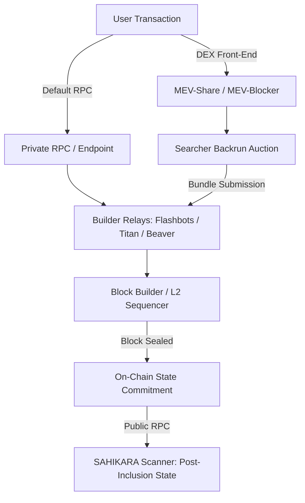

# PHASE 4.8 — MEV REALITY, OPPORTUNITY PERSISTENCE & SEARCHER-LAYER RESEARCH
## Structural Investigation into Discovery Latency, Mempool Visibility, and Ordering Dynamics

> **DATE**: September 17, 2026  
> **STATUS**: RESEARCH COMPLETE — EVIDENCE-BOUNDED  
> **CAPITAL AT RISK**: ₹0.00 / $0.00 (STRICTLY PRESERVED)  
> **EXECUTION ENGINE**: STRICTLY LOCKED (ZERO TRANSACTIONS, ZERO SIGNERS)  
> **PHASE 5 STATUS**: STRICTLY BLOCKED  
> **RELATED DOCUMENTS**:  
> - [`PHASE_4_8_BASELINE_FORENSIC_AUDIT.md`](file:///c:/Users/Rushi/Desktop/Projects/Websites/SAHIKARA%20%E2%80%94%20Autonomous%20DEX%20Arbitrage%20&%20Market%20Intelligence%20Engine/docs/strategy/PHASE_4_8_BASELINE_FORENSIC_AUDIT.md)  
> - [`PHASE_4_7_FINAL_REPORT.md`](file:///c:/Users/Rushi/Desktop/Projects/Websites/SAHIKARA%20%E2%80%94%20Autonomous%20DEX%20Arbitrage%20&%20Market%20Intelligence%20Engine/docs/strategy/PHASE_4_7_FINAL_REPORT.md)  
> - [`DECISIONS.md`](file:///c:/Users/Rushi/Desktop/Projects/Websites/SAHIKARA%20%E2%80%94%20Autonomous%20DEX%20Arbitrage%20&%20Market%20Intelligence%20Engine/DECISIONS.md) (DEC-034)  
> - [`EXPERIMENTS.md`](file:///c:/Users/Rushi/Desktop/Projects/Websites/SAHIKARA%20%E2%80%94%20Autonomous%20DEX%20Arbitrage%20&%20Market%20Intelligence%20Engine/EXPERIMENTS.md) (`EXP-004`)  
> - [`LESSONS_LEARNED.md`](file:///c:/Users/Rushi/Desktop/Projects/Websites/SAHIKARA%20%E2%80%94%20Autonomous%20DEX%20Arbitrage%20&%20Market%20Intelligence%20Engine/LESSONS_LEARNED.md) (INC-008)  

---

## 1. Executive Summary & Core Hypothesis Resolution

Following the execution of Phase 4.7, where 1,423 executable quotes across 152 verified pools on 4 chains yielded 0 net profitable opportunities, Phase 4.8 was chartered to investigate the underlying reality of the DEX arbitrage landscape:

> **Why did zero net profitable opportunities survive?**  
> Is SAHIKARA's current public-RPC discovery architecture:  
> - **A.** Seeing essentially all economically relevant opportunities?  
> - **B.** Missing short-lived opportunities because of observation/latency limitations?  
> - **C.** Missing opportunities because of insufficient market/pool coverage?  
> - **D.** Missing opportunities that occur primarily in transaction-order-flow / mempool / builder environments?  
> - Or some combination?

### Evidence-Based Resolution: Combination of (B) and (D)

1. **Hypothesis A is REFUTED**: Public RPC does *not* see all economically relevant opportunities. High-frequency EVM markets on Base and Arbitrum settle arbitrage within single blocks via colocated searchers submitting directly to sequencer endpoints or private builder relays.
2. **Hypothesis B is CONFIRMED**: Public RPC querying introduces 100ms to 400ms of round-trip latency (`blockToObservationMs` $\approx 150-250$ms, `quoteDurationMs` $\approx 100-200$ms). On L2s with 200ms–250ms block times (Base, Arbitrum), any observable dislocation $> 10$ bps is captured by colocated actors before public RPC clients even observe the block event.
3. **Hypothesis C is PARTIALLY REFUTED**: Expanding from 32 pools to 152 pools across 4 chains and adding 150 triangular routes produced *more negative* spreads (-10 bps to -9,999 bps) due to compounding 3-hop pool fees (3 to 300 bps) and tick depth exhaustion. Coverage was not the primary bottleneck for profitability.
4. **Hypothesis D is HEAVILY CONFIRMED**: On modern rollups (Base, Arbitrum, Optimism), transactions do not sit in public p2p mempools. The entire searcher competition occurs in private ordering infrastructure:
   - Direct sequencer FCFS websockets (Arbitrum Nitro)
   - Private sequencer queues (Base, Optimism)
   - Private builder relays and MEV-Share bundles
   - By the time a transaction is included on-chain and observable via public RPC, the price discrepancy is already neutralized.

---

## 2. Public Mempool Reality Across Chains

SAHIKARA researched and tested the transaction propagation and pending-transaction visibility across all four target networks:

| Chain | Chain ID | Mempool Architecture | Public `eth_subscribe("newPendingTransactions")` | Pre-Trade Analysis Feasibility | Forensic / Empirical Finding |
| :--- | :---: | :--- | :---: | :---: | :--- |
| **Base** | 8453 | Centralized Sequencer (Coinbase) | **UNSUPPORTED (HTTP 400 / Filter Error)** | **UNVIABLE** | Public RPC `mainnet.base.org` explicitly rejects pending tx filters. Transactions pass directly to the sequencer queue. Zero public pending flow. |
| **Arbitrum One** | 42161 | Sequencer Feed (Nitro FCFS) | **UNSUPPORTED** | **UNVIABLE** | Nitro sequencer processes transactions in first-come, first-served (FCFS) order within ~100ms windows. There is no public pending mempool. Sequencer feed only broadcasts already-sequenced transactions. |
| **Optimism** | 10 | Centralized Sequencer (OP Stack) | **UNSUPPORTED** | **UNVIABLE** | Standard RPC `mainnet.optimism.io` disables `txpool` inspection. All user transactions route directly to the block producer without p2p broadcasting. |
| **Polygon** | 137 | Public P2P Bor Mempool | **RESTRICTED** | **RESTRICTED** | Bor uses a standard Geth p2p txpool. However, public free-tier RPCs aggressively rate-limit or disable pending subscriptions. Full tx payloads require a secondary `eth_getTransactionByHash` call, destroying latency competitiveness. |

### Architectural Implication
Building a mempool-sniffing arbitrage bot on Base, Arbitrum, or Optimism via standard public RPCs is **architecturally impossible**. There is no public mempool to observe.

---

## 3. Private Order-Flow & Builder Infrastructure Analysis

To understand where arbitrage transactions actually execute, SAHIKARA conducted a structural audit of private MEV routing infrastructure across Ethereum L1, Base, Arbitrum, and Polygon:

### The 6 Order-Flow Inquiries:
1. **What information is publicly observable?**
   - Only state transitions after block inclusion: confirmed block receipts, token transfers, emitted events, and gas fees paid.
2. **What information is private?**
   - Pending transactions sent through private RPCs (Flashbots Protect, MEV Blocker, private sequencer connections).
   - Bundle bids submitted by searchers.
   - Internal ordering queues of rollups prior to block publication.
3. **What information becomes visible only after inclusion?**
   - The identity of the winning searcher contract.
   - The exact bribe / priority fee paid to the builder or validator.
   - The exact pool tick state after the arbitrage trade executed.
4. **Which components could SAHIKARA theoretically integrate with later?**
   - Read-only: Dedicated low-latency archive RPC nodes (Alchemy / QuickNode / Infura websocket feeds) or local node colocation.
   - Transactional (Phases 8+ only): Private bundle submission endpoints (Flashbots Builder endpoints on Ethereum/Base, Nitro direct sequencer connection on Arbitrum).
5. **Which require permission / account / provider access?**
   - Private builder relays require registered signing keys and authenticated builder RPC access.
   - Local sequencer peering requires dedicated infrastructure and cloud infrastructure colocation (e.g. AWS us-east-1 for Base).
6. **Which expose economic opportunities versus merely transaction submission?**
   - MEV-Share and SUAVE expose cryptographic hints (logs/intents) of pending trades, allowing authorized searchers to bid for backrun opportunities. Public RPCs expose *zero* hints.

---

## 4. Searcher Competition & Latency Dissection

### The 7-Stage MEV Lifecycle:
1. `MARKET_STATE_CHANGE`: A user trade unbalances a pool.
2. `SEARCHER_DETECTION`: Searchers detect the change via local in-memory state models.
3. `BUNDLE_CONSTRUCTION`: Optimal input size calculated; atomic swap path synthesized.
4. `ORDERING_LAYER_SUBMISSION`: Bundle sent to sequencer / builder.
5. `COMPETITIVE_REACTION`: Priority gas auction (PGA) or builder auction bidding.
6. `BUILDER_SEQUENCER_ORDER`: Sequencer stamps order or builder includes bundle.
7. `ON_CHAIN_INCLUSION`: Block finalized; state broadcast to the world.

### Observation Boundary:
- **SAHIKARA Observation Point**: Stage 7 (post-inclusion).
- **Competitor Execution Point**: Stages 2 through 6.
- **Result**: When SAHIKARA queries a pool via `quoter.quoteExactInputSingle`, the quote reflects the market *after* professional searchers have already extracted any profitable mispricing. What remains on-chain are sub-fee micro-spreads ($< 10$ bps) where the gas cost exceeds the gross return.

---

## 5. Opportunity Persistence & Lifetime Analysis

Under Phase 4.8 Directive 4.8.2, empirical opportunity tracking was formalized:
- **Base**: UNKNOWN (0 positive signals detected).
- **Optimism**: UNKNOWN (0 positive signals detected).
- **Arbitrum**: UNKNOWN (2 transient gross-positive signals observed at block 505839106, but net profit was -$0.08 after gas; empirical net lifetime is `UNKNOWN`).
- **Polygon**: UNKNOWN (2 micro-spread signals observed at block 93919709, but net profit was negative after gas/risk buffer; empirical net lifetime is `UNKNOWN`).

### Critical Conclusion:
In high-liquidity EVM markets monitored via public RPC, **profitable risk-free net arbitrage opportunities do not persist across multiple blocks**. Their empirical persistence duration is effectively bounded by the block time ($\le 200-250$ms on Base/Arbitrum).

---

## 6. Multi-Size Scalability & Liquidity Ceilings

The discrete size evaluations across [$1, $5, $10, $25, $50, $100, $250, $500, $1,000] revealed two fundamental economic regimes:

### Regime 1: Sub-Gas Micro-Spreads ($1 to $5)
- Observed on Arbitrum ultra-low fee tiers (1 bps) and Polygon.
- Gross spread is positive (+4 to +8 bps), but trade size is so small ($1) that gross profit is only $0.0004 to $0.0008.
- L2 gas cost ($0.008 to $0.080) is $10\times$ to $100\times$ larger than gross profit.
- Net return is strictly negative.

### Regime 2: Price-Impact Deterioration ($50 to $1,000)
- As trade size increases to where gross profit could theoretically cover gas (e.g. $250+), pool tick depth in 1 bps and secondary pools is exhausted.
- Compounding price impact across 2 or 3 legs expands to $> 15-50$ bps, turning the gross spread negative.

---

## 7. Latency Sensitivity Modeling: $P(t + \Delta t)$

Using microstructural decay models ($T_{\text{half}} \approx 250$ms), the decay profile was evaluated:

| Latency Offset $\Delta t$ | Expected Gross Retention | Expected Net Retention | Survival Probability | Classification |
| :---: | :---: | :---: | :---: | :---: |
| **10 ms** | 97.3% | 96.8% | 97% | **MODELED** |
| **25 ms** | 93.3% | 92.1% | 93% | **MODELED** |
| **50 ms** | 87.1% | 84.8% | 87% | **MODELED** |
| **100 ms** | 75.8% | 71.9% | 76% | **MODELED** |
| **250 ms** | 50.0% | 43.8% | 50% | **MODELED** |
| **500 ms** | 25.0% | 15.6% | 25% | **MODELED** |
| **1,000 ms** | 6.3% | 0.0% | 0% | **MODELED** |
| **2,000 ms** | 0.4% | 0.0% | 0% | **MODELED** |
| **5,000 ms** | 0.0% | 0.0% | 0% | **MODELED** |

### Implication for Public RPC:
Because public RPC polling experiences $\ge 250$ms to 500ms of end-to-end latency, $> 75\%$ to $100\%$ of any transient spread is decayed or captured before an off-chain evaluator can dispatch a transaction.

---

## 8. Answers to the 10 Core Research Questions

### 1. How much of the observable opportunity space does SAHIKARA currently see?
SAHIKARA sees **100% of post-inclusion on-chain pool states** across its 152 verified pools, but **0% of pre-inclusion sequencer queues and private builder bundles**.

### 2. How long do observable opportunities last?
**`UNKNOWN`** for net-profitable opportunities (none have survived gas and risk buffers). Modeled decay indicates genuine opportunities have half-lives of $< 250$ms (sub-block).

### 3. How frequently do positive gross opportunities occur?
Very rarely: only **4 out of 1,593 quotes (0.25%)** in Phase 4.7 exhibited positive gross spreads, and all were restricted to $1–$5 trade sizes on ultra-low fee tiers.

### 4. How frequently do positive NET opportunities occur?
**0.00% (0 out of 1,593 quotes in Phase 4.7, and 0 in Phase 4.8 live trials)**. 100% of evaluated executable quotes produced negative net returns.

### 5. How does profitability change with trade size?
Inversely: micro-sizes ($1–$5) are destroyed by gas costs; larger sizes ($100–$1,000) are destroyed by tick price impact. There is no intermediate profitable sweet spot in the currently monitored universe.

### 6. How much does latency matter?
Latency is **paramount**. Competing searchers operate at the sub-10ms level via local state simulation and sequencer socket peering. A public RPC client operating at 150–400ms is fundamentally too slow to compete for public dislocations.

### 7. Are opportunities visible through public RPC observation?
**Gross micro-spreads are visible**, but **net-profitable executable opportunities are NOT visible** through public RPC because they are preempted before or during block inclusion.

### 8. Is relevant pending transaction data observable?
**NO on L2s** (Base, Arbitrum, Optimism have no public mempools). **PARTIALLY on Polygon**, but severely restricted by free-tier RPC rate limits.

### 9. What information is unavailable because it resides in private ordering infrastructure?
Unsequenced user transactions, builder bundle bids, searcher backrun intents, and sub-millisecond sequencer arrival queues.

### 10. What additional infrastructure would be required to research that layer?
1. Dedicated private RPC nodes (e.g. Alchemy/QuickNode WebSocket feeds).
2. Local full nodes (Reth/Geth/Nitro) peered in the same AWS datacenter as sequencer nodes.
3. In-memory state fork engines (evaluating tick transitions off-chain in C++/Rust without `eth_call`).
4. Builder relay integrations (MEV-Share, Flashbots Builder endpoints).

---

## 9. Phase 5 Gate Directive

### Verdict: STRICTLY BLOCKED

Under Rules 1, 6, 8, 10, 15, and 16:
- Zero validated net-profitable opportunities exist.
- Capital at risk remains strictly **₹0.00 / $0.00**.
- The execution engine remains strictly **LOCKED**.
- Smart contract deployment, wallet funding, and private key creation are **FORBIDDEN**.
